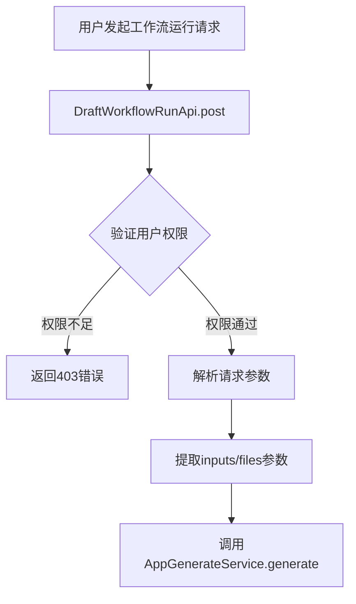
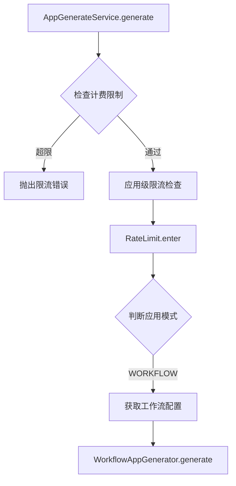
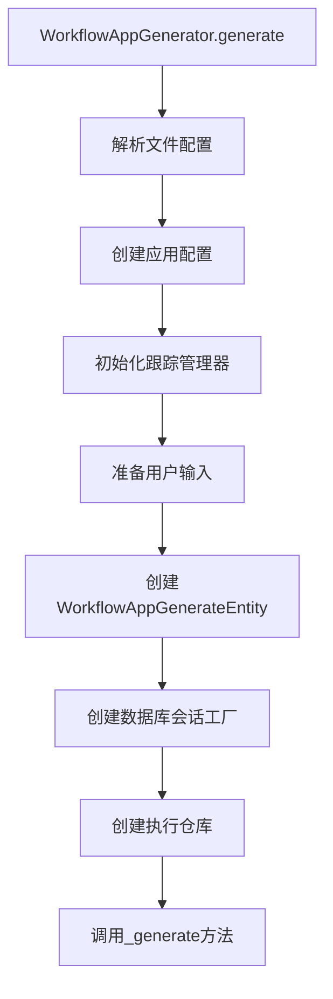
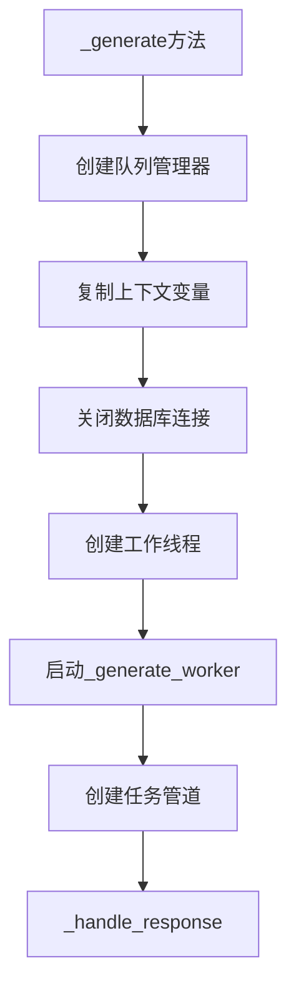
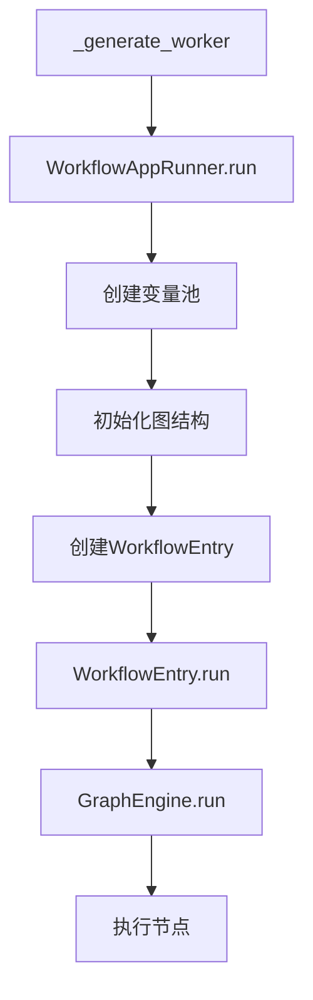
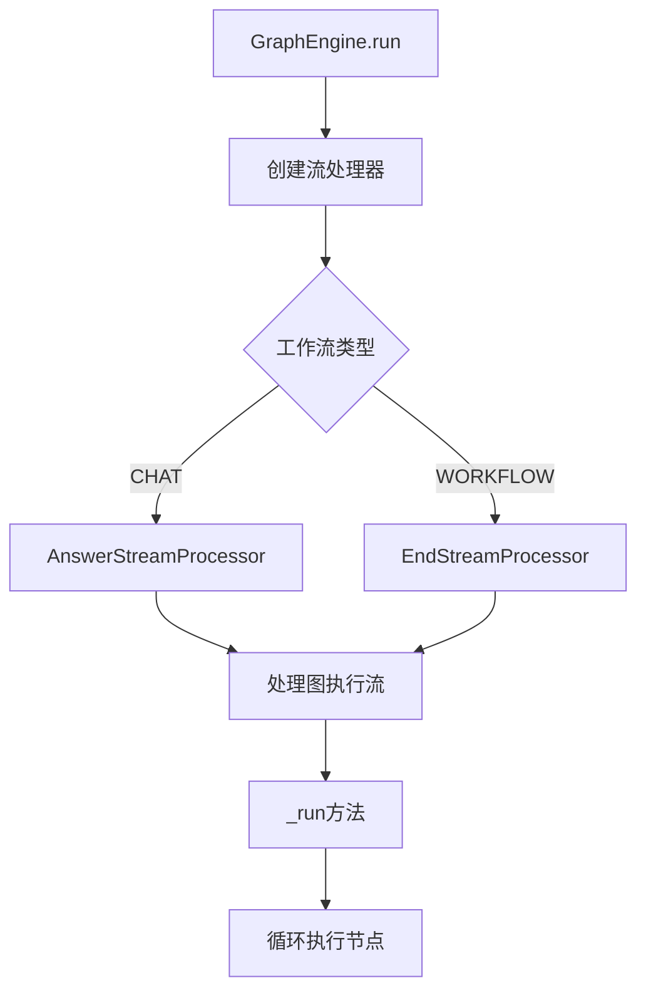
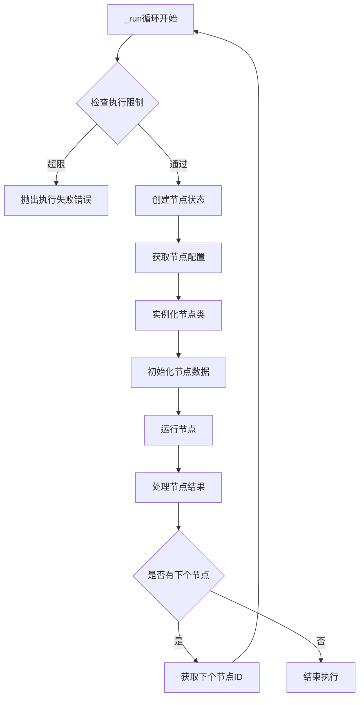
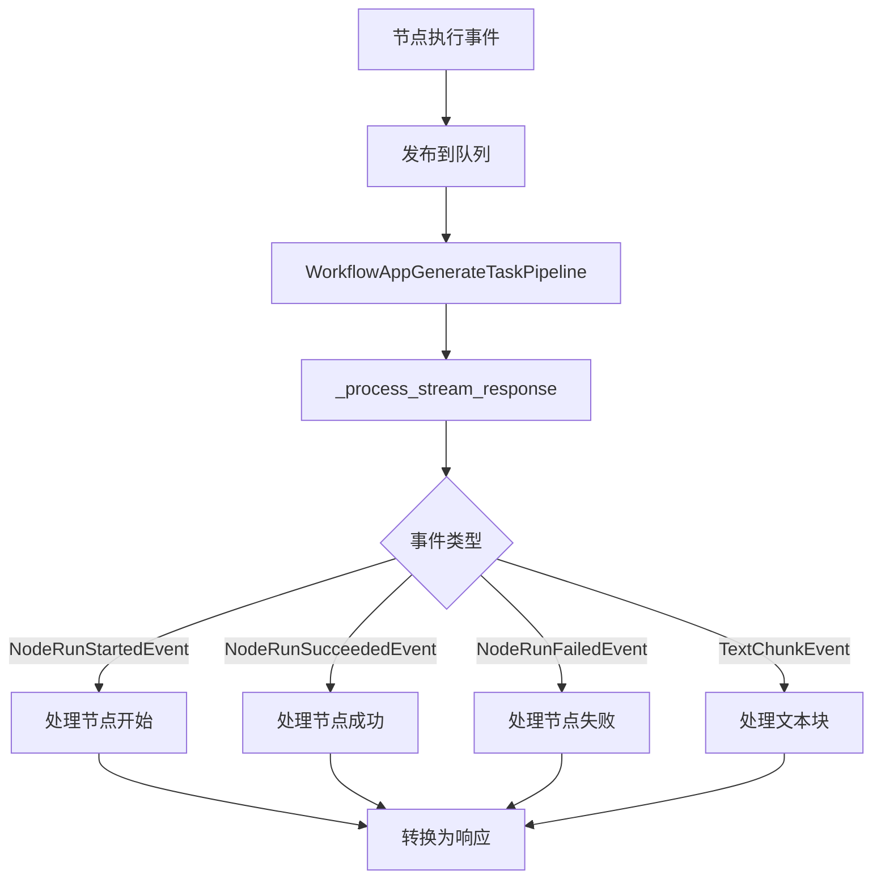
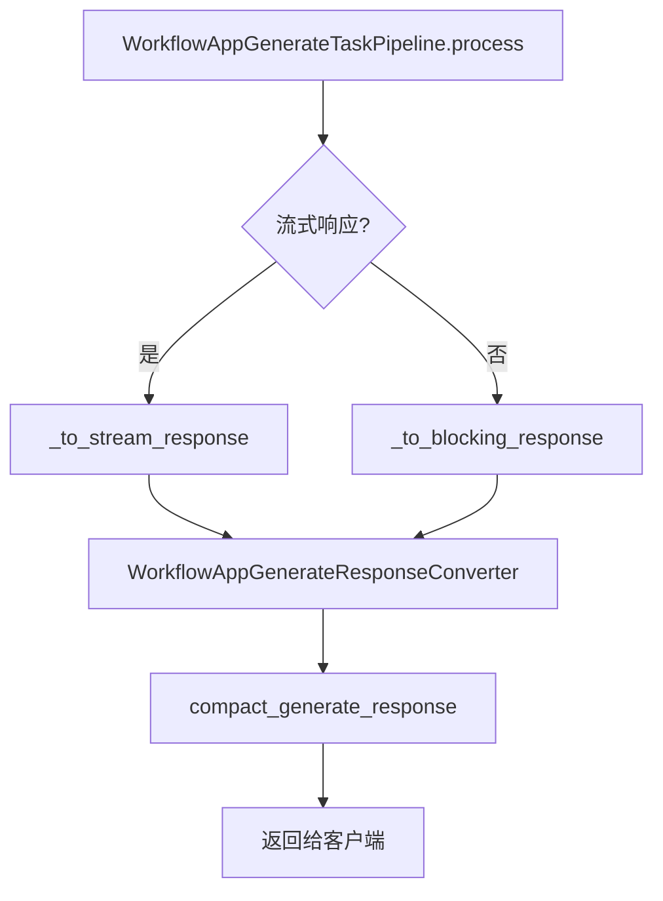

# 工作流执行流程详解

## 概述

本文档深入分析了Dify工作流执行的完整流程，从API请求到最终响应，涵盖了各个组件的交互和职责。

## 核心组件架构

### 1. 控制器层 (Controller Layer)
- **DraftWorkflowRunApi**: 处理工作流调试运行请求
- **权限验证**: 验证用户身份和编辑权限
- **参数解析**: 解析用户输入和文件上传

### 2. 服务层 (Service Layer)
- **AppGenerateService**: 应用生成服务的核心入口
- **WorkflowService**: 工作流相关业务逻辑
- **限流控制**: 系统级和应用级限流

### 3. 应用生成器层 (App Generator Layer)
- **WorkflowAppGenerator**: 工作流应用生成器
- **任务实体创建**: 创建工作流应用生成实体
- **多线程执行**: 使用独立线程执行工作流

### 4. 工作流引擎层 (Workflow Engine Layer)
- **WorkflowEntry**: 工作流入口点
- **GraphEngine**: 图形执行引擎
- **节点执行管理**: 管理各个节点的执行

### 5. 事件处理层 (Event Processing Layer)
- **队列管理**: AppQueueManager处理事件队列
- **流处理**: StreamProcessor处理输出流
- **事件分发**: 分发各种工作流事件

## 详细执行流程

### 阶段1: 请求接收与验证



### 阶段2: 服务层处理



### 阶段3: 工作流生成器处理



### 阶段4: 多线程执行



### 阶段5: 工作流引擎执行



### 阶段6: 图引擎节点执行



### 阶段7: 节点执行循环



### 阶段8: 事件流处理



### 阶段9: 响应转换与返回



## 关键数据结构

### WorkflowAppGenerateEntity
```python
class WorkflowAppGenerateEntity(AppGenerateEntity):
    """工作流应用生成实体 - 包含执行工作流所需的所有信息"""
    task_id: str                    # 任务ID
    app_config: WorkflowUIBasedAppConfig  # 应用配置
    inputs: Mapping[str, Any]       # 用户输入
    files: Sequence[File]           # 上传文件
    user_id: str                    # 用户ID
    stream: bool                    # 是否流式响应
    invoke_from: InvokeFrom         # 调用来源
    workflow_execution_id: str      # 工作流执行ID
```

### VariablePool
```python
class VariablePool(BaseModel):
    """变量池 - 管理工作流执行过程中的所有变量"""
    variable_dictionary: defaultdict[str, dict[int, VariableUnion]]  # 变量字典
    user_inputs: Mapping[str, Any]          # 用户输入
    system_variables: SystemVariable        # 系统变量
    environment_variables: Sequence[VariableUnion]  # 环境变量
    conversation_variables: Sequence[VariableUnion] # 对话变量
```

### GraphRuntimeState
```python
class GraphRuntimeState(BaseModel):
    """图运行时状态 - 跟踪工作流执行状态"""
    variable_pool: VariablePool     # 变量池
    start_at: float                 # 开始时间
    total_tokens: int               # 总令牌数
    llm_usage: LLMUsage            # LLM使用情况
    outputs: dict[str, Any]         # 输出结果
    node_run_steps: int            # 节点运行步数
    node_run_state: RuntimeRouteState  # 节点运行状态
```

## 核心设计模式

### 1. 责任链模式
- 请求通过多层处理：Controller -> Service -> Generator -> Engine
- 每层只负责自己的职责，便于维护和扩展

### 2. 观察者模式
- 使用事件驱动架构，节点执行产生事件
- 多个监听器处理不同类型的事件

### 3. 策略模式
- 不同类型的流处理器：AnswerStreamProcessor、EndStreamProcessor
- 不同类型的节点有不同的执行策略

### 4. 工厂模式
- RepositoryFactory创建不同类型的仓库
- NodeFactory创建不同类型的节点

### 5. 生产者-消费者模式
- AppQueueManager管理事件队列
- 工作线程生产事件，任务管道消费事件

## 性能优化要点

### 1. 异步执行
- 使用独立线程执行工作流，避免阻塞主线程
- 数据库连接在执行前关闭，避免长连接

### 2. 流式响应
- 支持流式输出，提升用户体验
- 事件驱动的响应机制

### 3. 资源管理
- 限流机制防止资源耗尽
- 线程池管理并发执行

### 4. 状态管理
- GraphRuntimeState集中管理执行状态
- VariablePool高效管理变量

## 错误处理机制

### 1. 分层错误处理
- 每层都有对应的异常处理
- 错误信息逐层传递和转换

### 2. 优雅降级
- 节点执行失败时的重试机制
- 部分失败时的继续执行策略

### 3. 资源清理
- 异常情况下的资源释放
- 数据库连接和线程的正确清理

## 监控与调试

### 1. 日志记录
- WorkflowLoggingCallback记录详细执行日志
- 分层次的日志输出

### 2. 事件跟踪
- TraceQueueManager管理追踪信息
- 执行路径的完整记录

### 3. 性能监控
- 执行时间和资源使用监控
- 节点级别的性能统计

## 扩展性设计

### 1. 插件化架构
- 节点类型的动态注册
- 新节点类型的轻松添加

### 2. 配置驱动
- 通过配置文件控制执行行为
- 仓库实现的可配置切换

### 3. 接口抽象
- 清晰的接口定义
- 实现与接口的分离

## 完整流程图

以下是Dify工作流执行的完整流程图，展示了从用户请求到最终响应的全部处理步骤：

```mermaid
graph TD
    %% 用户请求阶段
    A[用户发起工作流运行请求] --> B[DraftWorkflowRunApi.post]
    
    %% 权限验证阶段
    B --> C{验证用户权限}
    C -->|权限不足| D[返回403错误]
    C -->|权限通过| E[解析请求参数inputs/files]
    
    %% 服务层处理
    E --> F[AppGenerateService.generate]
    F --> G{检查计费限制}
    G -->|超限| H[抛出限流错误]
    G -->|通过| I[应用级限流检查]
    I --> J[RateLimit.enter获取执行权限]
    
    %% 路由到工作流生成器
    J --> K{判断应用模式}
    K -->|WORKFLOW| L[获取工作流配置]
    K -->|其他模式| M[路由到对应生成器]
    L --> N[WorkflowAppGenerator.generate]
    
    %% 工作流生成器处理
    N --> O[解析文件配置FileUploadConfigManager]
    O --> P[创建应用配置WorkflowAppConfigManager]
    P --> Q[初始化跟踪管理器TraceQueueManager]
    Q --> R[准备用户输入_prepare_user_inputs]
    R --> S[创建WorkflowAppGenerateEntity]
    
    %% 数据库仓库创建
    S --> T[创建数据库会话工厂sessionmaker]
    T --> U[创建工作流执行仓库]
    U --> V[创建节点执行仓库]
    
    %% 多线程执行设置
    V --> W[调用_generate方法]
    W --> X[创建WorkflowAppQueueManager]
    X --> Y[复制上下文变量contextvars]
    Y --> Z[关闭主线程数据库连接]
    Z --> AA[创建工作线程Thread]
    
    %% 工作线程执行
    AA --> BB[启动_generate_worker]
    BB --> CC[创建WorkflowAppRunner]
    CC --> DD[初始化变量池VariablePool]
    DD --> EE[创建系统变量SystemVariable]
    EE --> FF[初始化图结构Graph.init]
    
    %% 工作流引擎
    FF --> GG[创建WorkflowEntry]
    GG --> HH[WorkflowEntry.run]
    HH --> II[GraphEngine.run]
    II --> JJ{工作流类型}
    JJ -->|CHAT| KK[AnswerStreamProcessor]
    JJ -->|WORKFLOW| LL[EndStreamProcessor]
    
    %% 节点执行循环
    KK --> MM[GraphEngine._run开始节点循环]
    LL --> MM
    MM --> NN{检查执行限制}
    NN -->|超限| OO[抛出执行失败错误]
    NN -->|通过| PP[创建节点状态RouteNodeState]
    PP --> QQ[获取节点配置node_config]
    QQ --> RR[实例化节点类BaseNode]
    RR --> SS[初始化节点数据init_node_data]
    SS --> TT[运行节点node.run]
    
    %% 节点执行结果处理
    TT --> UU[处理节点结果]
    UU --> VV[发布节点事件到队列]
    VV --> WW{是否有下个节点}
    WW -->|是| XX[获取下个节点ID]
    XX --> PP
    WW -->|否| YY[工作流执行完成]
    
    %% 事件流处理
    VV --> ZZ[WorkflowAppGenerateTaskPipeline]
    ZZ --> AAA[_process_stream_response]
    AAA --> BBB{事件类型}
    BBB -->|NodeRunStartedEvent| CCC[处理节点开始事件]
    BBB -->|NodeRunSucceededEvent| DDD[处理节点成功事件]
    BBB -->|NodeRunFailedEvent| EEE[处理节点失败事件]
    BBB -->|TextChunkEvent| FFF[处理文本块事件]
    
    %% 响应转换
    CCC --> GGG[转换为WorkflowAppStreamResponse]
    DDD --> GGG
    EEE --> GGG
    FFF --> GGG
    GGG --> HHH[WorkflowAppGenerateResponseConverter]
    HHH --> III[compact_generate_response]
    
    %% 最终响应
    III --> JJJ[流式响应返回给客户端]
    YY --> KKK[最终结果处理]
    KKK --> GGG
    
    %% 错误处理
    OO --> LLL[错误事件发布]
    H --> LLL
    LLL --> MMM[错误响应返回]
    
    %% 资源清理
    JJJ --> NNN[释放限流资源rate_limit.exit]
    MMM --> NNN
    
    %% 样式定义
    classDef startEnd fill:#e1f5fe
    classDef process fill:#f3e5f5
    classDef decision fill:#fff3e0
    classDef error fill:#ffebee
    classDef storage fill:#e8f5e8
    
    class A,JJJ,MMM startEnd
    class B,F,N,W,BB,CC,GG,HH,II,ZZ,AAA,HHH,III process
    class C,G,K,NN,WW,BBB decision
    class D,H,OO,LLL,MMM error
    class T,U,V,DD,EE,FF storage
```



## 总结

Dify的工作流执行系统采用了分层架构和事件驱动设计，通过多个组件的协作实现了高效、可扩展的工作流执行。系统具有良好的性能、可靠性和可维护性，支持复杂的工作流场景。

通过本文档的详细分析和源码注释，开发者可以：

1. **深入理解工作流执行原理**：从请求接收到响应返回的完整流程
2. **掌握关键组件交互**：各层之间的职责分工和数据流转
3. **学习设计模式应用**：责任链、观察者、策略、工厂等模式的实际运用
4. **优化性能和扩展功能**：基于对架构的深入理解进行系统改进

### 代码注释完成情况

✅ **控制器层**：DraftWorkflowRunApi - 工作流运行入口点注释完成
✅ **服务层**：AppGenerateService.generate - 应用生成服务核心逻辑注释完成  
✅ **生成器层**：WorkflowAppGenerator - 工作流应用生成器注释完成
✅ **基础层**：BaseAppGenerator - 基础应用生成器注释完成
✅ **实体层**：app_invoke_entities - 应用调用实体定义注释完成
✅ **仓库层**：repositories/factory - 仓库工厂模式实现注释完成
✅ **流程图**：完整的工作流执行流程Mermaid图创建完成

### 技术要点总结

1. **多线程架构**：主线程处理响应，工作线程执行工作流，实现异步非阻塞
2. **事件驱动**：基于队列的事件发布订阅模式，解耦组件间依赖
3. **流式响应**：支持实时输出，提升用户体验
4. **限流机制**：系统级和应用级双重限流，保障系统稳定性
5. **仓库模式**：可配置的数据访问层，支持不同实现的灵活切换
6. **变量管理**：统一的变量池管理，支持复杂的数据流转
7. **错误处理**：分层的异常处理机制，确保系统健壮性

这套工作流执行系统体现了现代软件架构的最佳实践，为复杂业务场景提供了稳定可靠的技术支撑。