# Dify 数据库设计文档

## 概述

Dify 是一个基于 Flask 的 AI 应用开发平台，采用 PostgreSQL 作为主数据库，使用 SQLAlchemy ORM 进行数据库操作。本文档详细描述了 Dify 项目中的数据库实体结构和字段定义。

## 数据库实体表格

### 1. 系统配置相关

#### DifySetup - 系统初始化配置
| 字段名 | 类型 | 是否必填 | 默认值 | 描述 |
|--------|------|----------|--------|---------|
| version | String(255) | 是 | - | Dify 系统版本号 |
| setup_at | DateTime | 是 | CURRENT_TIMESTAMP | 系统初始化时间 |

### 2. 账户与租户管理

#### Account - 用户账户
| 字段名 | 类型 | 是否必填 | 默认值 | 描述 |
|--------|------|----------|--------|---------|
| id | StringUUID | 是 | uuid_generate_v4() | 账户唯一标识 |
| name | String(255) | 是 | - | 用户姓名 |
| email | String(255) | 是 | - | 邮箱地址 |
| password | String(255) | 否 | - | 密码哈希 |
| password_salt | String(255) | 否 | - | 密码盐值 |
| avatar | String(255) | 否 | - | 头像URL |
| interface_language | String(255) | 否 | - | 界面语言 |
| interface_theme | String(255) | 否 | - | 界面主题 |
| timezone | String(255) | 否 | - | 时区设置 |
| last_login_at | DateTime | 否 | - | 最后登录时间 |
| last_login_ip | String(255) | 否 | - | 最后登录IP |
| status | String(16) | 是 | active | 账户状态 |
| initialized_at | DateTime | 否 | - | 初始化时间 |
| created_at | DateTime | 是 | CURRENT_TIMESTAMP | 创建时间 |
| updated_at | DateTime | 是 | CURRENT_TIMESTAMP | 更新时间 |

#### Tenant - 租户
| 字段名 | 类型 | 是否必填 | 默认值 | 描述 |
|--------|------|----------|--------|---------|
| id | StringUUID | 是 | uuid_generate_v4() | 租户唯一标识 |
| name | String(255) | 是 | - | 租户名称 |
| encrypt_public_key | Text | 否 | - | 加密公钥 |
| plan | String(255) | 是 | basic | 订阅计划 |
| status | String(255) | 是 | normal | 租户状态 |
| custom_config | Text | 否 | - | 自定义配置JSON |
| created_at | DateTime | 是 | CURRENT_TIMESTAMP | 创建时间 |
| updated_at | DateTime | 是 | CURRENT_TIMESTAMP | 更新时间 |

#### TenantAccountJoin - 租户账户关联
| 字段名 | 类型 | 是否必填 | 默认值 | 描述 |
|--------|------|----------|--------|---------|
| id | StringUUID | 是 | uuid_generate_v4() | 关联唯一标识 |
| tenant_id | StringUUID | 是 | - | 租户ID |
| account_id | StringUUID | 是 | - | 账户ID |
| role | String(16) | 是 | - | 用户角色 |
| invited_by | StringUUID | 否 | - | 邀请人ID |
| created_at | DateTime | 是 | CURRENT_TIMESTAMP | 创建时间 |
| updated_at | DateTime | 是 | CURRENT_TIMESTAMP | 更新时间 |

### 3. 应用管理

#### App - 应用
| 字段名 | 类型 | 是否必填 | 默认值 | 描述 |
|--------|------|----------|--------|---------|
| id | StringUUID | 是 | uuid_generate_v4() | 应用唯一标识 |
| tenant_id | StringUUID | 是 | - | 租户ID |
| name | String(255) | 是 | - | 应用名称 |
| description | Text | 否 | - | 应用描述 |
| mode | String(255) | 是 | - | 应用模式 |
| icon | String(255) | 否 | - | 应用图标 |
| icon_background | String(255) | 否 | - | 图标背景色 |
| app_model_config_id | StringUUID | 否 | - | 应用模型配置ID |
| status | String(255) | 是 | normal | 应用状态 |
| enable_site | Boolean | 是 | true | 是否启用站点 |
| enable_api | Boolean | 是 | true | 是否启用API |
| api_rpm | Integer | 是 | 0 | API每分钟请求限制 |
| api_rph | Integer | 是 | 0 | API每小时请求限制 |
| is_demo | Boolean | 是 | false | 是否为演示应用 |
| is_public | Boolean | 是 | false | 是否公开 |
| is_universal | Boolean | 是 | false | 是否通用 |
| created_at | DateTime | 是 | CURRENT_TIMESTAMP | 创建时间 |
| updated_at | DateTime | 是 | CURRENT_TIMESTAMP | 更新时间 |

#### Conversation - 会话
| 字段名 | 类型 | 是否必填 | 默认值 | 描述 |
|--------|------|----------|--------|---------|
| id | StringUUID | 是 | uuid_generate_v4() | 会话唯一标识 |
| app_id | StringUUID | 是 | - | 应用ID |
| app_model_config_id | StringUUID | 否 | - | 应用模型配置ID |
| model_provider | String(255) | 否 | - | 模型提供商 |
| override_model_configs | Text | 否 | - | 覆盖模型配置JSON |
| model_id | String(255) | 否 | - | 模型ID |
| mode | String(255) | 是 | - | 会话模式 |
| name | String(255) | 是 | - | 会话名称 |
| summary | Text | 否 | - | 会话摘要 |
| inputs | Text | 否 | - | 输入参数JSON |
| introduction | Text | 否 | - | 会话介绍 |
| system_instruction | Text | 否 | - | 系统指令 |
| system_instruction_tokens | Integer | 是 | 0 | 系统指令token数 |
| status | String(255) | 是 | normal | 会话状态 |
| from_source | String(255) | 是 | - | 来源 |
| from_end_user_id | StringUUID | 否 | - | 终端用户ID |
| from_account_id | StringUUID | 否 | - | 账户ID |
| read_at | DateTime | 否 | - | 已读时间 |
| read_account_id | StringUUID | 否 | - | 已读账户ID |
| created_at | DateTime | 是 | CURRENT_TIMESTAMP | 创建时间 |
| updated_at | DateTime | 是 | CURRENT_TIMESTAMP | 更新时间 |

### 4. 数据集管理

#### Dataset - 数据集
| 字段名 | 类型 | 是否必填 | 默认值 | 描述 |
|--------|------|----------|--------|---------|
| id | StringUUID | 是 | uuid_generate_v4() | 数据集唯一标识 |
| tenant_id | StringUUID | 是 | - | 租户ID |
| name | String(255) | 是 | - | 数据集名称 |
| description | Text | 否 | - | 数据集描述 |
| provider | String(255) | 是 | vendor | 提供商 |
| permission | String(255) | 是 | only_me | 权限设置 |
| data_source_type | String(255) | 否 | - | 数据源类型 |
| indexing_technique | String(255) | 否 | - | 索引技术 |
| index_struct | Text | 否 | - | 索引结构JSON |
| created_by | StringUUID | 是 | - | 创建者ID |
| created_at | DateTime | 是 | CURRENT_TIMESTAMP | 创建时间 |
| updated_at | DateTime | 是 | CURRENT_TIMESTAMP | 更新时间 |

#### Document - 文档
| 字段名 | 类型 | 是否必填 | 默认值 | 描述 |
|--------|------|----------|--------|---------|
| id | StringUUID | 是 | uuid_generate_v4() | 文档唯一标识 |
| tenant_id | StringUUID | 是 | - | 租户ID |
| dataset_id | StringUUID | 是 | - | 数据集ID |
| position | Integer | 是 | - | 文档位置 |
| data_source_type | String(255) | 是 | - | 数据源类型 |
| data_source_info | Text | 否 | - | 数据源信息JSON |
| dataset_process_rule_id | StringUUID | 否 | - | 数据集处理规则ID |
| batch | String(255) | 是 | - | 批次标识 |
| name | String(255) | 是 | - | 文档名称 |
| created_from | String(255) | 是 | - | 创建来源 |
| created_by | StringUUID | 是 | - | 创建者ID |
| created_api_request_id | StringUUID | 否 | - | 创建API请求ID |
| processing_started_at | DateTime | 否 | - | 处理开始时间 |
| parsing_completed_at | DateTime | 否 | - | 解析完成时间 |
| cleaning_completed_at | DateTime | 否 | - | 清理完成时间 |
| splitting_completed_at | DateTime | 否 | - | 分割完成时间 |
| tokens | Integer | 是 | 0 | token数量 |
| indexing_status | String(255) | 是 | - | 索引状态 |
| error | Text | 否 | - | 错误信息 |
| enabled | Boolean | 是 | true | 是否启用 |
| disabled_at | DateTime | 否 | - | 禁用时间 |
| disabled_by | StringUUID | 否 | - | 禁用者ID |
| archived | Boolean | 是 | false | 是否归档 |
| archived_reason | String(255) | 否 | - | 归档原因 |
| archived_by | StringUUID | 否 | - | 归档者ID |
| archived_at | DateTime | 否 | - | 归档时间 |
| created_at | DateTime | 是 | CURRENT_TIMESTAMP | 创建时间 |
| updated_at | DateTime | 是 | CURRENT_TIMESTAMP | 更新时间 |

### 5. 工作流管理

#### Workflow - 工作流
| 字段名 | 类型 | 是否必填 | 默认值 | 描述 |
|--------|------|----------|--------|---------|
| id | StringUUID | 是 | uuid_generate_v4() | 工作流唯一标识 |
| tenant_id | StringUUID | 是 | - | 租户ID |
| app_id | StringUUID | 是 | - | 应用ID |
| type | String(255) | 是 | - | 工作流类型 |
| version | String(255) | 是 | - | 版本号 |
| graph | Text | 否 | - | 工作流画布配置JSON |
| features | Text | 否 | - | 功能配置JSON |
| created_by | StringUUID | 是 | - | 创建者ID |
| created_at | DateTime | 是 | CURRENT_TIMESTAMP | 创建时间 |
| updated_by | StringUUID | 否 | - | 更新者ID |
| updated_at | DateTime | 是 | CURRENT_TIMESTAMP | 更新时间 |
| environment_variables | Text | 否 | - | 环境变量JSON |
| conversation_variables | Text | 否 | - | 会话变量JSON |

### 6. 模型提供商管理

#### Provider - 模型提供商
| 字段名 | 类型 | 是否必填 | 默认值 | 描述 |
|--------|------|----------|--------|---------|
| id | StringUUID | 是 | uuid_generate_v4() | 提供商唯一标识 |
| tenant_id | StringUUID | 是 | - | 租户ID |
| provider_name | String(255) | 是 | - | 提供商名称 |
| provider_type | String(40) | 是 | custom | 提供商类型 |
| encrypted_config | Text | 否 | - | 加密配置 |
| is_valid | Boolean | 是 | false | 是否有效 |
| last_used | DateTime | 否 | - | 最后使用时间 |
| quota_type | String(40) | 否 | - | 配额类型 |
| quota_limit | BigInteger | 否 | - | 配额限制 |
| quota_used | BigInteger | 否 | 0 | 已使用配额 |
| created_at | DateTime | 是 | CURRENT_TIMESTAMP | 创建时间 |
| updated_at | DateTime | 是 | CURRENT_TIMESTAMP | 更新时间 |

### 7. 工具管理

#### ApiToolProvider - API工具提供商
| 字段名 | 类型 | 是否必填 | 默认值 | 描述 |
|--------|------|----------|--------|---------|
| id | StringUUID | 是 | uuid_generate_v4() | 工具提供商唯一标识 |
| name | String(255) | 是 | API KEY 1 | 提供商名称 |
| icon | String(255) | 是 | - | 图标 |
| schema | Text | 是 | - | 原始schema |
| schema_type_str | String(40) | 是 | - | schema类型 |
| user_id | StringUUID | 是 | - | 创建者ID |
| tenant_id | StringUUID | 是 | - | 租户ID |
| description | Text | 是 | - | 描述 |
| tools_str | Text | 是 | - | 工具JSON格式 |
| credentials_str | Text | 是 | - | 凭证JSON格式 |
| privacy_policy | String(255) | 否 | - | 隐私政策 |
| custom_disclaimer | Text | 否 | - | 自定义免责声明 |
| created_at | DateTime | 是 | CURRENT_TIMESTAMP | 创建时间 |
| updated_at | DateTime | 是 | CURRENT_TIMESTAMP | 更新时间 |

### 8. 任务管理

#### CeleryTask - Celery任务
| 字段名 | 类型 | 是否必填 | 默认值 | 描述 |
|--------|------|----------|--------|---------|
| id | Integer | 是 | 自增 | 任务ID |
| task_id | String(155) | 是 | - | 任务唯一标识 |
| status | String(50) | 是 | PENDING | 任务状态 |
| result | PickleType | 否 | - | 任务结果 |
| date_done | DateTime | 否 | - | 完成时间 |
| traceback | Text | 否 | - | 错误堆栈 |
| name | String(155) | 否 | - | 任务名称 |
| args | LargeBinary | 否 | - | 任务参数 |
| kwargs | LargeBinary | 否 | - | 任务关键字参数 |
| worker | String(155) | 否 | - | 工作进程 |
| retries | Integer | 否 | - | 重试次数 |
| queue | String(155) | 否 | - | 队列名称 |

### 9. Web相关

#### SavedMessage - 保存的消息
| 字段名 | 类型 | 是否必填 | 默认值 | 描述 |
|--------|------|----------|--------|---------|
| id | StringUUID | 是 | uuid_generate_v4() | 保存消息唯一标识 |
| app_id | StringUUID | 是 | - | 应用ID |
| message_id | StringUUID | 是 | - | 消息ID |
| created_by_role | String(255) | 是 | end_user | 创建者角色 |
| created_by | StringUUID | 是 | - | 创建者ID |
| created_at | DateTime | 是 | CURRENT_TIMESTAMP | 创建时间 |

### 10. 数据源管理

#### DataSourceOauthBinding - 数据源OAuth绑定
| 字段名 | 类型 | 是否必填 | 默认值 | 描述 |
|--------|------|----------|--------|---------|
| id | StringUUID | 是 | uuid_generate_v4() | 绑定唯一标识 |
| tenant_id | StringUUID | 是 | - | 租户ID |
| access_token | String(255) | 是 | - | 访问令牌 |
| provider | String(255) | 是 | - | 提供商 |
| source_info | JSONB | 是 | - | 源信息JSON |
| created_at | DateTime | 是 | CURRENT_TIMESTAMP | 创建时间 |
| updated_at | DateTime | 是 | CURRENT_TIMESTAMP | 更新时间 |
| disabled | Boolean | 否 | false | 是否禁用 |

## 实体关系图

```mermaid
erDiagram
    %% 账户与租户关系
    Account ||--o{ TenantAccountJoin : "has"
    Tenant ||--o{ TenantAccountJoin : "belongs to"
    
    %% 应用相关关系
    Tenant ||--o{ App : "owns"
    App ||--o{ Conversation : "has"
    App ||--o{ Workflow : "contains"
    App ||--o{ SavedMessage : "stores"
    App ||--o{ PinnedConversation : "pins"
    
    %% 数据集相关关系
    Tenant ||--o{ Dataset : "manages"
    Dataset ||--o{ Document : "contains"
    Dataset ||--o{ DocumentSegment : "segments"
    App ||--o{ AppDatasetJoin : "uses"
    Dataset ||--o{ AppDatasetJoin : "joined by"
    
    %% 消息相关关系
    Conversation ||--o{ Message : "contains"
    Message ||--o{ MessageAgentThought : "has thoughts"
    Message ||--o{ SavedMessage : "can be saved"
    
    %% 模型提供商关系
    Tenant ||--o{ Provider : "configures"
    Tenant ||--o{ ProviderModel : "uses"
    Tenant ||--o{ TenantDefaultModel : "sets default"
    Provider ||--o{ ProviderOrder : "orders"
    
    %% 工具相关关系
    Tenant ||--o{ ApiToolProvider : "creates"
    Tenant ||--o{ BuiltinToolProvider : "configures"
    Tenant ||--o{ WorkflowToolProvider : "develops"
    Tenant ||--o{ MCPToolProvider : "integrates"
    Account ||--o{ ApiToolProvider : "authors"
    Account ||--o{ BuiltinToolProvider : "sets up"
    
    %% 数据源关系
    Tenant ||--o{ DataSourceOauthBinding : "binds"
    Tenant ||--o{ DataSourceApiKeyAuthBinding : "authenticates"
    
    %% 扩展关系
    Tenant ||--o{ APIBasedExtension : "extends"
    
    %% 标签关系
    Tag ||--o{ TagBinding : "binds to"
    
    %% 权限关系
    Tenant ||--o{ TenantPluginPermission : "grants"
    Dataset ||--o{ DatasetPermission : "controls access"
    
    %% 实体定义
    Account {
        string id PK
        string name
        string email
        string password
        string status
        datetime created_at
        datetime updated_at
    }
    
    Tenant {
        string id PK
        string name
        string plan
        string status
        text custom_config
        datetime created_at
        datetime updated_at
    }
    
    TenantAccountJoin {
        string id PK
        string tenant_id FK
        string account_id FK
        string role
        string invited_by
        datetime created_at
        datetime updated_at
    }
    
    App {
        string id PK
        string tenant_id FK
        string name
        text description
        string mode
        string status
        boolean enable_site
        boolean enable_api
        datetime created_at
        datetime updated_at
    }
    
    Conversation {
        string id PK
        string app_id FK
        string name
        text summary
        text inputs
        string status
        string from_source
        datetime created_at
        datetime updated_at
    }
    
    Message {
        string id PK
        string app_id FK
        string conversation_id FK
        text query
        text answer
        string status
        datetime created_at
        datetime updated_at
    }
    
    Dataset {
        string id PK
        string tenant_id FK
        string name
        text description
        string provider
        string permission
        string indexing_technique
        datetime created_at
        datetime updated_at
    }
    
    Document {
        string id PK
        string tenant_id FK
        string dataset_id FK
        string name
        string data_source_type
        string indexing_status
        boolean enabled
        datetime created_at
        datetime updated_at
    }
    
    Workflow {
        string id PK
        string tenant_id FK
        string app_id FK
        string type
        string version
        text graph
        datetime created_at
        datetime updated_at
    }
    
    Provider {
        string id PK
        string tenant_id FK
        string provider_name
        string provider_type
        text encrypted_config
        boolean is_valid
        datetime created_at
        datetime updated_at
    }
    
    ApiToolProvider {
        string id PK
        string name
        string tenant_id FK
        string user_id FK
        text schema
        text tools_str
        text credentials_str
        datetime created_at
        datetime updated_at
    }
    
    SavedMessage {
        string id PK
        string app_id FK
        string message_id FK
        string created_by_role
        string created_by
        datetime created_at
    }
    
    DataSourceOauthBinding {
        string id PK
        string tenant_id FK
        string access_token
        string provider
        jsonb source_info
        boolean disabled
        datetime created_at
        datetime updated_at
    }
    
    APIBasedExtension {
        string id PK
        string tenant_id FK
        string name
        string api_endpoint
        text api_key
        datetime created_at
    }
    
    Tag {
        string id PK
        string tenant_id FK
        string type
        string name
        datetime created_at
        datetime updated_at
    }
    
    TagBinding {
        string id PK
        string tenant_id FK
        string tag_id FK
        string target_id
        datetime created_at
        datetime updated_at
    }
```

## 数据库设计特点

### 1. 多租户架构
- 大部分实体都包含 `tenant_id` 字段，支持多租户数据隔离
- 通过租户ID实现数据的逻辑分离和权限控制

### 2. 统一的主键设计
- 使用 StringUUID 作为主键类型，确保全局唯一性
- 支持 PostgreSQL 的 UUID 类型和其他数据库的 CHAR(36) 类型

### 3. 审计字段
- 大部分表都包含 `created_at` 和 `updated_at` 字段
- 支持创建者和更新者的追踪（`created_by`, `updated_by`）

### 4. 灵活的配置存储
- 使用 JSON/JSONB 字段存储复杂配置信息
- 支持动态配置和扩展性需求

### 5. 状态管理
- 实体普遍包含状态字段，支持生命周期管理
- 软删除机制（如 `enabled`, `disabled`, `archived` 字段）

### 6. 安全性设计
- 敏感信息使用加密存储（`encrypted_config`, `encrypted_credentials`）
- 支持多种认证方式（OAuth, API Key, 密码等）

### 7. 扩展性
- 插件系统支持（工具提供商、API扩展等）
- 工作流引擎支持复杂业务逻辑
- 数据集和文档管理支持多种数据源

## 总结

Dify 的数据库设计体现了现代 SaaS 应用的典型特征：多租户架构、微服务友好、高度可配置、安全可靠。通过合理的实体关系设计和字段定义，支持了 AI 应用开发平台的核心功能需求。