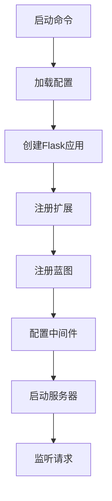

# 应用入口层

## 概述

应用入口层是Dify API服务的启动入口，负责初始化Flask应用、配置加载、扩展注册等核心启动流程。

## 文件结构

```
├── app.py                 # Flask应用主入口
├── app_factory.py         # 应用工厂模式
├── dify_app.py           # Dify应用核心启动
└── commands.py           # 命令行工具
```

## 详细分析

### 1. app.py - Flask应用主入口

**职责**: 
- 创建Flask应用实例
- 注册蓝图(Blueprint)
- 配置中间件
- 启动应用服务器

**核心功能**:
- 应用初始化
- 路由注册
- 错误处理
- 开发/生产环境配置

**关键代码结构**:
```python
# 应用创建
app = create_app()

# 蓝图注册
app.register_blueprint(console_bp, url_prefix='/console/api')
app.register_blueprint(web_bp, url_prefix='/api')
app.register_blueprint(service_api_bp, url_prefix='/v1')

# 启动服务器
if __name__ == '__main__':
    app.run(host='0.0.0.0', port=5001)
```

### 2. app_factory.py - 应用工厂模式

**职责**:
- 实现工厂模式创建Flask应用
- 配置加载和验证
- 扩展初始化
- 数据库连接配置

**核心功能**:
- 配置管理
- 扩展注册
- 中间件配置
- 错误处理器注册

**设计模式**:
- 工厂模式：统一的应用创建接口
- 依赖注入：配置和扩展的注入
- 单例模式：确保应用实例唯一性

### 3. dify_app.py - Dify应用核心启动

**职责**:
- Dify特定的应用配置
- 业务逻辑初始化
- 服务启动顺序管理
- 健康检查配置

**核心功能**:
- 业务服务初始化
- 定时任务启动
- 监控指标配置
- 优雅关闭处理

### 4. commands.py - 命令行工具

**职责**:
- 提供CLI命令接口
- 数据库管理命令
- 系统维护命令
- 开发调试命令

**主要命令**:
```bash
# 密码重置
flask reset-password --email user@example.com --new-password newpass

# 数据库迁移
flask db upgrade

# 创建超级用户
flask create-super-user

# 清理过期日志
flask clear-free-plan-tenant-expired-logs
```

## 启动流程



## 配置管理

### 环境变量
- `FLASK_ENV`: 运行环境(development/production)
- `DATABASE_URL`: 数据库连接字符串
- `REDIS_URL`: Redis连接字符串
- `SECRET_KEY`: 应用密钥

### 配置文件
- `configs/app_config.py`: 主配置文件
- `configs/deploy/`: 部署配置
- `configs/enterprise/`: 企业配置

## 扩展系统

### 已注册扩展
- **数据库**: SQLAlchemy
- **缓存**: Redis
- **任务队列**: Celery
- **存储**: 文件存储扩展
- **监控**: 可观测性扩展

### 扩展初始化顺序
1. 基础扩展(数据库、缓存)
2. 业务扩展(存储、监控)
3. 应用扩展(认证、权限)

## 错误处理

### 全局错误处理器
- 404错误处理
- 500错误处理
- 自定义异常处理
- 日志记录

### 错误响应格式
```json
{
    "code": "error_code",
    "message": "错误描述",
    "details": {}
}
```

## 性能优化

### 启动优化
- 延迟加载
- 配置缓存
- 连接池配置

### 运行时优化
- 请求压缩
- 静态文件缓存
- 数据库连接池

## 安全配置

### 安全中间件
- CORS配置
- CSRF保护
- 请求限流
- 安全头设置

### 认证配置
- JWT配置
- Session配置
- OAuth配置

## 监控和日志

### 日志配置
- 结构化日志
- 日志级别配置
- 日志轮转

### 监控指标
- 请求统计
- 性能指标
- 业务指标

## 部署相关

### Docker支持
- Dockerfile配置
- 多阶段构建
- 健康检查

### 环境适配
- 开发环境
- 测试环境
- 生产环境

## 开发指南

### 本地开发
```bash
# 安装依赖
pip install -r requirements.txt

# 设置环境变量
export FLASK_ENV=development

# 启动开发服务器
python app.py
```

### 调试模式
- 热重载
- 调试器
- 详细错误信息

### 测试
- 单元测试
- 集成测试
- 端到端测试

---

*本文档详细描述了Dify API应用入口层的架构和实现* 