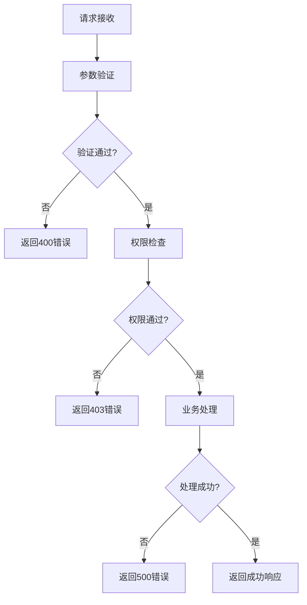

# 控制器层 (controllers/)

## 概述

控制器层是Dify API的HTTP接口层，负责处理客户端请求、参数验证、权限检查、业务逻辑调用和响应返回。采用RESTful API设计，支持多种客户端类型。

## 目录结构

```
controllers/
├── __init__.py                    # 控制器模块初始化
├── common/                        # 通用控制器
│   ├── errors.py                 # 错误处理
│   ├── fields.py                 # 字段定义
│   └── helpers.py                # 辅助函数
├── console/                       # 控制台API (管理后台)
│   ├── __init__.py
│   ├── admin.py                  # 管理员功能
│   ├── apikey.py                 # API密钥管理
│   ├── app/                      # 应用管理
│   ├── auth/                     # 认证授权
│   ├── billing/                  # 计费功能
│   ├── datasets/                 # 数据集管理
│   ├── explore/                  # 探索功能
│   ├── tag/                      # 标签管理
│   └── workspace/                # 工作空间管理
├── files/                        # 文件处理
│   ├── __init__.py
│   ├── error.py                  # 文件错误处理
│   └── image_preview.py          # 图片预览
├── inner_api/                    # 内部API
│   ├── __init__.py
│   ├── mail.py                   # 邮件服务
│   ├── plugin/                   # 插件相关
│   ├── workspace/                # 工作空间内部API
│   └── wraps.py                  # 包装器
├── mcp/                          # MCP协议
│   ├── __init__.py
│   └── mcp.py                    # Model Context Protocol
├── service_api/                  # 服务API
│   ├── __init__.py
│   ├── app/                      # 应用服务API
│   ├── dataset/                  # 数据集服务API
│   ├── index.py                  # 服务API入口
│   ├── workspace/                # 工作空间服务API
│   └── wraps.py                  # 服务API包装器
└── web/                          # Web API
    ├── __init__.py
    ├── app.py                    # Web应用API
    └── audio.py                  # 音频处理API
```

## 详细分析

### 1. common/ - 通用控制器

#### 1.1 errors.py - 错误处理

**职责**:
- 定义API错误码
- 统一错误响应格式
- 错误处理中间件
- 异常转换

**错误类型**:
```python
class APIError(Exception):
    """API基础错误类"""
    def __init__(self, code, message, details=None):
        self.code = code
        self.message = message
        self.details = details

class ValidationError(APIError):
    """参数验证错误"""
    pass

class AuthenticationError(APIError):
    """认证错误"""
    pass

class AuthorizationError(APIError):
    """授权错误"""
    pass

class ResourceNotFoundError(APIError):
    """资源不存在错误"""
    pass
```

#### 1.2 fields.py - 字段定义

**职责**:
- 请求参数字段定义
- 响应字段定义
- 字段验证规则
- 序列化配置

**字段类型**:
```python
from flask_restful import fields

# 基础字段
string_field = fields.String
integer_field = fields.Integer
boolean_field = fields.Boolean
datetime_field = fields.DateTime

# 复杂字段
nested_field = fields.Nested
list_field = fields.List
raw_field = fields.Raw
```

#### 1.3 helpers.py - 辅助函数

**职责**:
- 通用工具函数
- 请求处理辅助
- 响应格式化
- 文件处理

**主要功能**:
- 文件信息提取
- MIME类型检测
- URL解析
- 参数验证

### 2. console/ - 控制台API

**职责**: 为管理后台提供API接口，支持应用管理、用户管理、系统配置等功能。

#### 2.1 admin.py - 管理员功能

**功能**:
- 系统管理
- 用户管理
- 配置管理
- 监控管理

**主要接口**:
```python
# 系统状态
GET /console/api/admin/system/status

# 用户管理
GET /console/api/admin/users
POST /console/api/admin/users
PUT /console/api/admin/users/{user_id}

# 系统配置
GET /console/api/admin/config
PUT /console/api/admin/config
```

#### 2.2 apikey.py - API密钥管理

**功能**:
- API密钥生成
- 密钥权限管理
- 使用统计
- 密钥轮换

**主要接口**:
```python
# 密钥列表
GET /console/api/apikeys

# 创建密钥
POST /console/api/apikeys

# 更新密钥
PUT /console/api/apikeys/{key_id}

# 删除密钥
DELETE /console/api/apikeys/{key_id}
```

#### 2.3 app/ - 应用管理

**功能**:
- 应用CRUD操作
- 应用配置管理
- 应用部署
- 应用监控

**主要接口**:
```python
# 应用列表
GET /console/api/apps

# 创建应用
POST /console/api/apps

# 应用详情
GET /console/api/apps/{app_id}

# 更新应用
PUT /console/api/apps/{app_id}

# 删除应用
DELETE /console/api/apps/{app_id}

# 复制应用
POST /console/api/apps/{app_id}/copy

# 导出应用
GET /console/api/apps/{app_id}/export
```

#### 2.4 auth/ - 认证授权

**功能**:
- 用户登录
- 用户注册
- 密码重置
- 权限验证

**主要接口**:
```python
# 用户登录
POST /console/api/auth/login

# 用户注册
POST /console/api/auth/register

# 密码重置
POST /console/api/auth/reset-password

# 刷新令牌
POST /console/api/auth/refresh

# 用户登出
POST /console/api/auth/logout
```

#### 2.5 billing/ - 计费功能

**功能**:
- 计费计划管理
- 使用量统计
- 账单生成
- 支付处理

**主要接口**:
```python
# 计费计划
GET /console/api/billing/plans

# 使用量统计
GET /console/api/billing/usage

# 账单历史
GET /console/api/billing/invoices

# 支付配置
GET /console/api/billing/payment-methods
```

#### 2.6 datasets/ - 数据集管理

**功能**:
- 数据集CRUD
- 文档管理
- 索引管理
- 数据同步

**主要接口**:
```python
# 数据集列表
GET /console/api/datasets

# 创建数据集
POST /console/api/datasets

# 数据集详情
GET /console/api/datasets/{dataset_id}

# 文档管理
GET /console/api/datasets/{dataset_id}/documents
POST /console/api/datasets/{dataset_id}/documents

# 索引管理
POST /console/api/datasets/{dataset_id}/index
```

#### 2.7 explore/ - 探索功能

**功能**:
- 应用探索
- 模板浏览
- 示例查看
- 推荐系统

**主要接口**:
```python
# 应用探索
GET /console/api/explore/apps

# 模板列表
GET /console/api/explore/templates

# 示例应用
GET /console/api/explore/examples

# 推荐内容
GET /console/api/explore/recommendations
```

#### 2.8 tag/ - 标签管理

**功能**:
- 标签CRUD
- 标签绑定
- 标签搜索
- 标签统计

**主要接口**:
```python
# 标签列表
GET /console/api/tags

# 创建标签
POST /console/api/tags

# 标签详情
GET /console/api/tags/{tag_id}

# 标签绑定
POST /console/api/tags/{tag_id}/bind
```

#### 2.9 workspace/ - 工作空间管理

**功能**:
- 工作空间CRUD
- 成员管理
- 权限管理
- 资源管理

**主要接口**:
```python
# 工作空间列表
GET /console/api/workspaces

# 创建工作空间
POST /console/api/workspaces

# 工作空间详情
GET /console/api/workspaces/{workspace_id}

# 成员管理
GET /console/api/workspaces/{workspace_id}/members
POST /console/api/workspaces/{workspace_id}/members
```

### 3. files/ - 文件处理

**职责**: 处理文件上传、下载、预览等文件相关操作。

#### 3.1 error.py - 文件错误处理

**功能**:
- 文件上传错误
- 文件格式错误
- 文件大小错误
- 存储错误

#### 3.2 image_preview.py - 图片预览

**功能**:
- 图片缩略图生成
- 图片格式转换
- 图片压缩
- 图片水印

**主要接口**:
```python
# 图片预览
GET /api/files/{file_id}/preview

# 图片缩略图
GET /api/files/{file_id}/thumbnail

# 图片信息
GET /api/files/{file_id}/info
```

### 4. inner_api/ - 内部API

**职责**: 为内部服务提供API接口，支持服务间通信。

#### 4.1 mail.py - 邮件服务

**功能**:
- 邮件发送
- 邮件模板
- 邮件队列
- 邮件状态

**主要接口**:
```python
# 发送邮件
POST /inner/api/mail/send

# 邮件模板
GET /inner/api/mail/templates

# 邮件状态
GET /inner/api/mail/status/{mail_id}
```

#### 4.2 plugin/ - 插件相关

**功能**:
- 插件管理
- 插件调用
- 插件配置
- 插件监控

#### 4.3 workspace/ - 工作空间内部API

**功能**:
- 工作空间验证
- 权限检查
- 资源分配
- 状态同步

#### 4.4 wraps.py - 包装器

**功能**:
- 请求包装
- 响应包装
- 错误包装
- 日志包装

### 5. mcp/ - MCP协议

**职责**: 实现Model Context Protocol，支持与外部工具的集成。

#### 5.1 mcp.py - Model Context Protocol

**功能**:
- MCP服务器
- 工具注册
- 资源管理
- 协议处理

**主要接口**:
```python
# MCP服务器状态
GET /mcp/status

# 工具列表
GET /mcp/tools

# 资源列表
GET /mcp/resources

# 调用工具
POST /mcp/call
```

### 6. service_api/ - 服务API

**职责**: 为第三方服务提供API接口，支持应用集成。

#### 6.1 app/ - 应用服务API

**功能**:
- 应用调用
- 对话管理
- 消息处理
- 结果返回

**主要接口**:
```python
# 应用调用
POST /v1/apps/{app_id}/chat
POST /v1/apps/{app_id}/completion

# 对话管理
GET /v1/apps/{app_id}/conversations
POST /v1/apps/{app_id}/conversations

# 消息处理
GET /v1/apps/{app_id}/conversations/{conversation_id}/messages
POST /v1/apps/{app_id}/conversations/{conversation_id}/messages
```

#### 6.2 dataset/ - 数据集服务API

**功能**:
- 数据检索
- 知识查询
- 相似度搜索
- 数据更新

**主要接口**:
```python
# 数据检索
POST /v1/datasets/{dataset_id}/retrieve

# 知识查询
POST /v1/datasets/{dataset_id}/query

# 相似度搜索
POST /v1/datasets/{dataset_id}/similarity-search
```

#### 6.3 workspace/ - 工作空间服务API

**功能**:
- 工作空间验证
- 资源访问
- 权限检查
- 状态查询

#### 6.4 wraps.py - 服务API包装器

**功能**:
- 请求验证
- 响应格式化
- 错误处理
- 日志记录

### 7. web/ - Web API

**职责**: 为Web前端提供API接口，支持用户交互。

#### 7.1 app.py - Web应用API

**功能**:
- 应用展示
- 用户交互
- 实时通信
- 状态同步

**主要接口**:
```python
# 应用信息
GET /api/apps/{app_id}

# 用户交互
POST /api/apps/{app_id}/chat
POST /api/apps/{app_id}/completion

# 实时通信
GET /api/apps/{app_id}/stream
```

#### 7.2 audio.py - 音频处理API

**功能**:
- 音频上传
- 语音识别
- 语音合成
- 音频转换

**主要接口**:
```python
# 音频上传
POST /api/audio/upload

# 语音识别
POST /api/audio/speech-to-text

# 语音合成
POST /api/audio/text-to-speech

# 音频转换
POST /api/audio/convert
```

## API设计规范

### 1. RESTful设计

**资源命名**:
- 使用名词复数形式
- 使用小写字母和连字符
- 避免动词和特殊字符

**HTTP方法**:
- GET: 获取资源
- POST: 创建资源
- PUT: 更新资源
- DELETE: 删除资源
- PATCH: 部分更新

### 2. 请求格式

**Content-Type**:
- application/json: JSON数据
- multipart/form-data: 文件上传
- application/x-www-form-urlencoded: 表单数据

**请求头**:
```http
Authorization: Bearer <token>
Content-Type: application/json
Accept: application/json
X-Request-ID: <request_id>
```

### 3. 响应格式

**成功响应**:
```json
{
    "code": "success",
    "message": "操作成功",
    "data": {},
    "timestamp": "2024-01-01T00:00:00Z"
}
```

**错误响应**:
```json
{
    "code": "error_code",
    "message": "错误描述",
    "details": {},
    "timestamp": "2024-01-01T00:00:00Z"
}
```

### 4. 分页格式

**分页参数**:
- page: 页码
- limit: 每页数量
- offset: 偏移量

**分页响应**:
```json
{
    "data": [],
    "pagination": {
        "page": 1,
        "limit": 20,
        "total": 100,
        "pages": 5
    }
}
```

## 权限控制

### 1. 认证机制

**JWT Token**:
- Access Token: 短期访问令牌
- Refresh Token: 长期刷新令牌
- Token验证和刷新

**API Key**:
- 密钥认证
- 权限范围
- 使用限制

### 2. 授权机制

**角色权限**:
- 超级管理员
- 工作空间管理员
- 普通用户
- 只读用户

**资源权限**:
- 应用权限
- 数据集权限
- 文件权限
- API权限

### 3. 权限检查

**中间件检查**:
- 认证中间件
- 授权中间件
- 权限验证
- 访问日志

## 错误处理

### 1. 错误分类

**客户端错误 (4xx)**:
- 400 Bad Request: 请求参数错误
- 401 Unauthorized: 认证失败
- 403 Forbidden: 权限不足
- 404 Not Found: 资源不存在
- 429 Too Many Requests: 请求频率限制

**服务器错误 (5xx)**:
- 500 Internal Server Error: 服务器内部错误
- 502 Bad Gateway: 网关错误
- 503 Service Unavailable: 服务不可用

### 2. 错误处理流程



## 性能优化

### 1. 请求优化

**缓存策略**:
- 响应缓存
- 查询缓存
- 静态资源缓存

**压缩传输**:
- Gzip压缩
- 响应压缩
- 图片压缩

### 2. 并发处理

**异步处理**:
- 异步任务
- 消息队列
- 后台处理

**连接池**:
- 数据库连接池
- Redis连接池
- HTTP连接池

## 监控和日志

### 1. 请求监控

**监控指标**:
- 请求数量
- 响应时间
- 错误率
- 并发数

### 2. 访问日志

**日志内容**:
- 请求时间
- 请求方法
- 请求路径
- 响应状态
- 响应时间
- 用户信息

### 3. 错误日志

**错误记录**:
- 错误堆栈
- 请求上下文
- 用户信息
- 系统状态

---

*本文档详细描述了Dify API控制器层的架构和实现* 