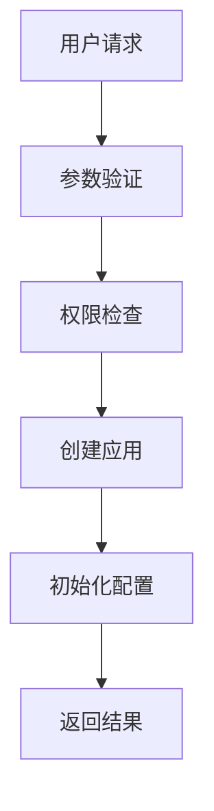
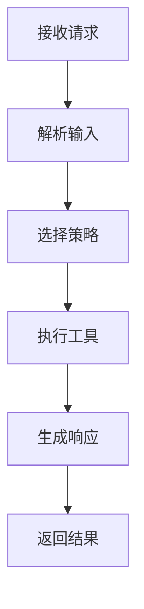
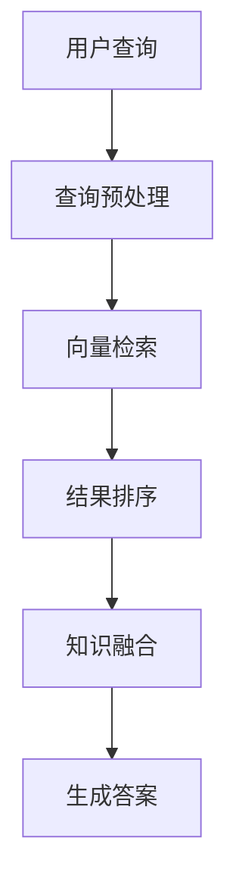
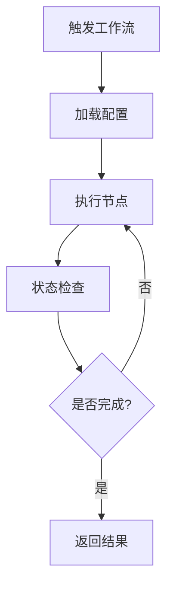

# 核心业务层 (core/) - 概述

## 概述

核心业务层是Dify API的核心，包含所有业务逻辑的实现。这一层实现了AI应用开发平台的核心功能，包括智能体系统、应用管理、模型运行时、RAG系统、工作流引擎、插件系统等。

## 目录结构

```
core/
├── __init__.py                    # 核心模块初始化
├── agent/                         # 智能体系统
│   ├── __init__.py
│   ├── base_agent_runner.py      # 基础智能体运行器
│   ├── cot_agent_runner.py       # Chain of Thought智能体
│   ├── output_parser/            # 输出解析器
│   ├── prompt/                   # 提示词管理
│   └── strategy/                 # 策略实现
├── app/                          # 应用管理
│   ├── __init__.py
│   ├── app_config/              # 应用配置
│   ├── apps/                    # 应用实体
│   ├── entities/                # 实体定义
│   ├── features/                # 功能特性
│   └── task_pipeline/           # 任务流水线
├── base/                        # 基础功能
│   ├── __init__.py
│   └── tts/                     # 文本转语音
├── callback_handler/            # 回调处理
│   ├── __init__.py
│   ├── agent_tool_callback_handler.py
│   ├── index_tool_callback_handler.py
│   └── tool_callback_handler.py
├── entities/                    # 核心实体
│   ├── __init__.py
│   ├── agent_entities.py        # 智能体实体
│   ├── embedding_type.py        # 嵌入类型
│   └── model_entities.py        # 模型实体
├── errors/                      # 错误定义
│   ├── __init__.py
│   └── error.py                 # 错误类
├── extension/                   # 扩展系统
│   ├── __init__.py
│   ├── api_based_extension_requestor.py
│   ├── extensible.py            # 可扩展接口
│   └── extension_manager.py     # 扩展管理器
├── external_data_tool/          # 外部数据工具
│   ├── __init__.py
│   ├── api/                     # API工具
│   ├── base.py                  # 基础工具类
│   └── external_data_fetch.py   # 外部数据获取
├── file/                        # 文件处理
│   ├── __init__.py
│   ├── constants.py             # 文件常量
│   ├── enums.py                 # 文件枚举
│   └── file_manager.py          # 文件管理器
├── helper/                      # 辅助工具
│   ├── __init__.py
│   ├── code_executor/           # 代码执行器
│   ├── download.py              # 下载工具
│   ├── encrypter.py             # 加密工具
│   └── utils.py                 # 工具函数
├── hosting_configuration.py     # 托管配置
├── indexing_runner.py           # 索引运行器
├── llm_generator/               # LLM生成器
│   ├── __init__.py
│   ├── llm_generator.py         # LLM生成器
│   ├── output_parser/           # 输出解析器
│   └── prompts.py               # 提示词
├── mcp/                         # MCP协议
│   ├── __init__.py
│   ├── auth/                    # 认证
│   ├── client/                  # 客户端
│   ├── entities.py              # MCP实体
│   ├── error.py                 # MCP错误
│   ├── server/                  # 服务器
│   └── session/                 # 会话管理
├── memory/                      # 内存管理
│   └── token_buffer_memory.py   # Token缓冲内存
├── model_runtime/               # 模型运行时
│   ├── __init__.py
│   ├── callbacks/               # 回调处理
│   ├── entities/                # 运行时实体
│   ├── errors/                  # 运行时错误
│   ├── model_providers/         # 模型提供商
│   ├── schema_validators/       # 模式验证器
│   └── utils/                   # 运行时工具
├── moderation/                  # 内容审核
│   ├── __init__.py
│   ├── api/                     # 审核API
│   ├── base.py                  # 审核基础类
│   ├── factory.py               # 审核工厂
│   ├── keywords/                # 关键词审核
│   └── openai_moderation/       # OpenAI审核
├── ops/                         # 运维监控
│   ├── __init__.py
│   ├── aliyun_trace/            # 阿里云追踪
│   ├── arize_phoenix_trace/     # Arize Phoenix追踪
│   ├── base_trace_instance.py   # 基础追踪实例
│   ├── entities/                # 运维实体
│   ├── langfuse_trace/          # Langfuse追踪
│   ├── langsmith_trace/         # LangSmith追踪
│   ├── opik_trace/              # Opik追踪
│   ├── ops_trace_manager.py     # 运维追踪管理器
│   └── weave_trace/             # Weave追踪
├── plugin/                      # 插件系统
│   ├── __init__.py
│   ├── backwards_invocation/    # 向后调用
│   ├── endpoint/                # 插件端点
│   ├── entities/                # 插件实体
│   ├── impl/                    # 插件实现
│   └── utils/                   # 插件工具
├── prompt/                      # 提示词管理
│   ├── __init__.py
│   ├── advanced_prompt_transform.py
│   ├── agent_history_prompt_transform.py
│   ├── entities/                # 提示词实体
│   ├── prompt_templates/        # 提示词模板
│   └── utils/                   # 提示词工具
├── rag/                         # RAG系统
│   ├── __init__.py
│   ├── cleaner/                 # 数据清理
│   ├── data_post_processor/     # 数据后处理
│   ├── datasource/              # 数据源
│   ├── docstore/                # 文档存储
│   ├── embedding/               # 嵌入处理
│   ├── entities/                # RAG实体
│   └── extractor/               # 数据提取器
├── repositories/                # 仓储层
│   ├── __init__.py
│   ├── app_repository.py        # 应用仓储
│   ├── dataset_repository.py    # 数据集仓储
│   └── user_repository.py       # 用户仓储
├── tools/                       # 工具系统
│   ├── __init__.py
│   ├── base.py                  # 工具基础类
│   ├── tool_manager.py          # 工具管理器
│   └── utils/                   # 工具工具
├── variables/                   # 变量管理
│   ├── __init__.py
│   ├── entities.py              # 变量实体
│   ├── manager.py               # 变量管理器
│   └── utils.py                 # 变量工具
├── workflow/                    # 工作流引擎
│   ├── __init__.py
│   ├── entities/                # 工作流实体
│   ├── nodes/                   # 工作流节点
│   ├── runner.py                # 工作流运行器
│   └── utils/                   # 工作流工具
├── hosting_configuration.py     # 托管配置
└── indexing_runner.py           # 索引运行器
```

## 核心模块概览

### 1. Agent (智能体系统)
- **职责**: 实现AI智能体的核心逻辑
- **功能**: 智能体运行、策略执行、工具调用
- **特点**: 支持多种智能体类型，可扩展的策略系统

### 2. App (应用管理)
- **职责**: 管理AI应用的生命周期
- **功能**: 应用创建、配置、部署、监控
- **特点**: 多模式支持，可视化配置

### 3. Model Runtime (模型运行时)
- **职责**: 管理AI模型的运行环境
- **功能**: 模型加载、推理、优化
- **特点**: 多提供商支持，统一接口

### 4. RAG (检索增强生成)
- **职责**: 实现知识检索和增强生成
- **功能**: 文档处理、向量检索、知识融合
- **特点**: 多数据源支持，高效检索

### 5. Workflow (工作流引擎)
- **职责**: 管理复杂的AI工作流
- **功能**: 节点编排、流程控制、状态管理
- **特点**: 可视化设计，灵活配置

### 6. Plugin (插件系统)
- **职责**: 提供可扩展的插件机制
- **功能**: 插件开发、加载、管理
- **特点**: 标准化接口，热插拔

### 7. Tools (工具系统)
- **职责**: 管理AI应用的工具集
- **功能**: 工具注册、调用、管理
- **特点**: 丰富工具库，易于扩展

## 架构设计原则

### 1. 模块化设计
- 每个模块职责单一
- 模块间松耦合
- 支持独立开发和测试

### 2. 可扩展性
- 插件化架构
- 标准化接口
- 支持第三方扩展

### 3. 高性能
- 异步处理
- 缓存机制
- 资源池化

### 4. 可观测性
- 完整的监控体系
- 分布式追踪
- 详细日志记录

### 5. 安全性
- 输入验证
- 权限控制
- 数据加密

## 核心流程

### 1. 应用创建流程


### 2. 智能体执行流程


### 3. RAG检索流程


### 4. 工作流执行流程


## 技术特点

### 1. 多模型支持
- OpenAI GPT系列
- Anthropic Claude系列
- 开源模型支持
- 自定义模型集成

### 2. 多向量数据库
- Weaviate
- Pinecone
- Qdrant
- Milvus

### 3. 多存储后端
- 本地存储
- S3兼容存储
- Azure Blob
- Google Cloud Storage

### 4. 多部署模式
- 单机部署
- 集群部署
- 云原生部署
- 边缘部署

## 性能优化

### 1. 并发处理
- 异步任务队列
- 连接池管理
- 负载均衡

### 2. 缓存策略
- 多级缓存
- 智能缓存失效
- 缓存预热

### 3. 资源管理
- 内存池化
- 连接复用
- 垃圾回收优化

## 监控和运维

### 1. 性能监控
- 响应时间监控
- 吞吐量监控
- 资源使用监控

### 2. 错误监控
- 异常捕获
- 错误分类
- 告警机制

### 3. 业务监控
- 用户行为分析
- 功能使用统计
- 业务指标监控

---

*本文档概述了Dify API核心业务层的整体架构和设计理念* 