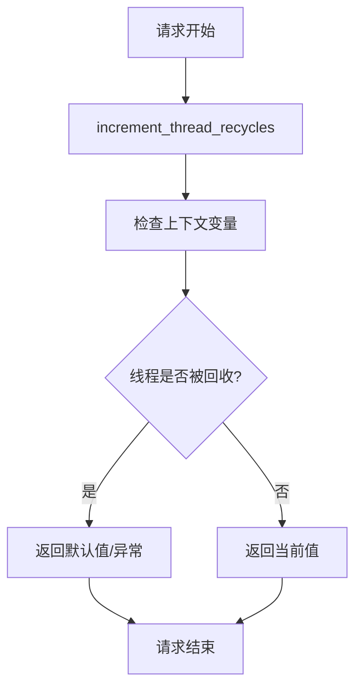

# 08-上下文管理层

## 概述

上下文管理层（`contexts/`）负责管理请求上下文、会话状态和线程安全的数据共享。该层解决了在Gunicorn多线程环境下的上下文隔离和状态保持问题，确保插件系统、模型运行时等组件能够正确地在请求间共享状态。

## 目录结构

```
contexts/
├── __init__.py                    # 上下文变量定义
└── wrapper.py                     # 可回收上下文变量包装器
```

## 核心文件详解

### 1. `__init__.py` - 上下文变量定义

**职责**: 定义系统中使用的各种上下文变量，包括插件工具提供者、模型提供者、模式锁等。

**核心上下文变量**:
```python
# 插件工具提供者上下文
plugin_tool_providers: RecyclableContextVar[dict[str, "PluginToolProviderController"]]
plugin_tool_providers_lock: RecyclableContextVar[Lock]

# 插件模型提供者上下文
plugin_model_providers: RecyclableContextVar[list["PluginModelProviderEntity"] | None]
plugin_model_providers_lock: RecyclableContextVar[Lock]

# 插件模型模式锁
plugin_model_schema_lock: RecyclableContextVar[Lock]

# 插件模型模式上下文
plugin_model_schemas: RecyclableContextVar[dict[str, "AIModelEntity"]]
```

**设计特点**:
- 使用`RecyclableContextVar`包装器确保线程安全
- 为每个上下文变量提供对应的锁机制
- 支持类型注解提高代码可读性

### 2. `wrapper.py` - 可回收上下文变量包装器

**职责**: 提供线程安全的上下文变量管理，解决Gunicorn线程回收导致的竞态条件问题。

**核心类**:
```python
class RecyclableContextVar(Generic[T]):
    """
    可回收上下文变量包装器
    在Gunicorn线程回收环境下安全使用
    """
```

**关键方法**:
```python
@classmethod
def increment_thread_recycles(cls):
    """增加线程回收计数"""
    try:
        recycles = cls._thread_recycles.get()
        cls._thread_recycles.set(recycles + 1)
    except LookupError:
        cls._thread_recycles.set(0)

def get(self, default: T | HiddenValue = _default) -> T:
    """获取上下文变量值"""
    thread_recycles = self._thread_recycles.get(0)
    self_updates = self._updates.get()
    
    # 检查线程是否被回收
    if thread_recycles < self_updates:
        return self._context_var.get()
    else:
        # 线程被回收，返回默认值或抛出异常
        if isinstance(default, HiddenValue):
            raise LookupError
        else:
            return default

def set(self, value: T):
    """设置上下文变量值"""
    thread_recycles = self._thread_recycles.get(0)
    self_updates = self._updates.get()
    
    # 更新计数器
    if thread_recycles > self_updates:
        self._updates.set(thread_recycles)
    
    # 设置值
    self._context_var.set(value)
```

## 设计原理

### 1. 线程回收问题

在Gunicorn等WSGI服务器中，线程可能被回收和重用，这会导致以下问题：
- 上下文变量在请求间泄漏
- 竞态条件导致数据不一致
- 内存泄漏和性能问题

### 2. 解决方案

`RecyclableContextVar`通过以下机制解决这些问题：

**线程回收检测**:
```python
# 全局线程回收计数器
_thread_recycles: ContextVar[int] = ContextVar("thread_recycles")

# 每个变量的更新计数器
_updates = ContextVar[int](context_var.name + "_updates", default=0)
```

**状态验证**:
- 比较线程回收计数和变量更新计数
- 如果线程被回收，返回默认值或抛出异常
- 确保数据的一致性和安全性

### 3. 使用流程



## 使用示例

### 1. 基本使用

```python
from contexts import plugin_tool_providers

# 设置上下文变量
plugin_tool_providers.set({"tool1": provider1, "tool2": provider2})

# 获取上下文变量
try:
    providers = plugin_tool_providers.get()
    print(f"当前工具提供者: {providers}")
except LookupError:
    print("上下文变量未设置")
```

### 2. 带默认值的使用

```python
from contexts import plugin_model_providers

# 获取上下文变量，提供默认值
providers = plugin_model_providers.get(default=[])
print(f"模型提供者数量: {len(providers)}")
```

### 3. 线程安全操作

```python
from contexts import plugin_tool_providers, plugin_tool_providers_lock

# 使用锁确保线程安全
with plugin_tool_providers_lock.get():
    providers = plugin_tool_providers.get(default={})
    providers["new_tool"] = new_provider
    plugin_tool_providers.set(providers)
```

### 4. 请求中间件集成

```python
from flask import Flask
from contexts import RecyclableContextVar

app = Flask(__name__)

@app.before_request
def before_request():
    """请求前增加线程回收计数"""
    RecyclableContextVar.increment_thread_recycles()
```

## 最佳实践

### 1. 初始化时机
- 在请求开始时调用`increment_thread_recycles()`
- 在Flask中间件中统一处理

### 2. 错误处理
- 总是处理`LookupError`异常
- 提供合适的默认值

### 3. 线程安全
- 使用提供的锁机制保护共享数据
- 避免在上下文变量中存储可变对象

### 4. 性能考虑
- 避免在上下文变量中存储大量数据
- 及时清理不再需要的上下文变量

### 5. 调试支持
- 添加日志记录上下文变量的设置和获取
- 监控线程回收频率

## 扩展指南

### 添加新的上下文变量

1. **定义变量**:
```python
# 在contexts/__init__.py中添加
new_context_var: RecyclableContextVar[YourType] = RecyclableContextVar(
    ContextVar("new_context_var")
)
```

2. **添加锁**（如需要）:
```python
new_context_var_lock: RecyclableContextVar[Lock] = RecyclableContextVar(
    ContextVar("new_context_var_lock")
)
```

3. **类型注解**:
```python
if TYPE_CHECKING:
    from your_module import YourType
```

### 自定义上下文管理器

```python
class CustomContextManager:
    def __init__(self, context_var: RecyclableContextVar[T]):
        self.context_var = context_var
    
    def __enter__(self):
        # 进入上下文时的处理
        return self.context_var.get()
    
    def __exit__(self, exc_type, exc_val, exc_tb):
        # 退出上下文时的清理
        pass
```

## 故障排除

### 常见问题

1. **LookupError异常**
   - 原因：线程被回收，上下文变量失效
   - 解决：提供默认值或重新初始化

2. **数据不一致**
   - 原因：多线程访问未加锁
   - 解决：使用提供的锁机制

3. **内存泄漏**
   - 原因：上下文变量未及时清理
   - 解决：在请求结束时清理不需要的数据

### 调试技巧

```python
import logging

logger = logging.getLogger(__name__)

def debug_context_var(context_var, name):
    try:
        value = context_var.get()
        logger.debug(f"{name}: {value}")
    except LookupError:
        logger.debug(f"{name}: 未设置")
```

---

*上下文管理层为系统提供了线程安全的上下文管理机制，确保在多线程环境下的数据一致性和安全性。* 