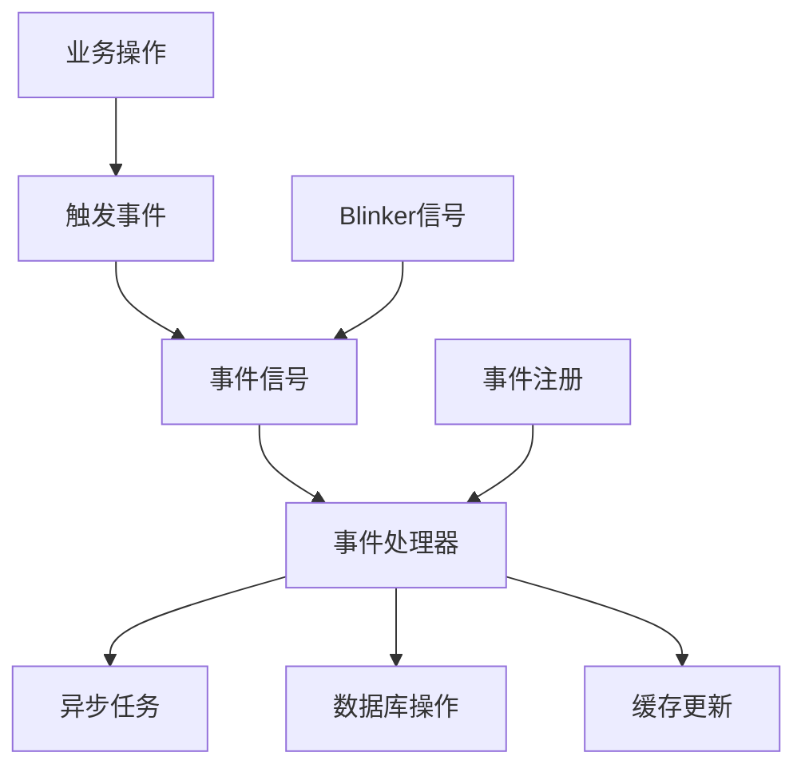
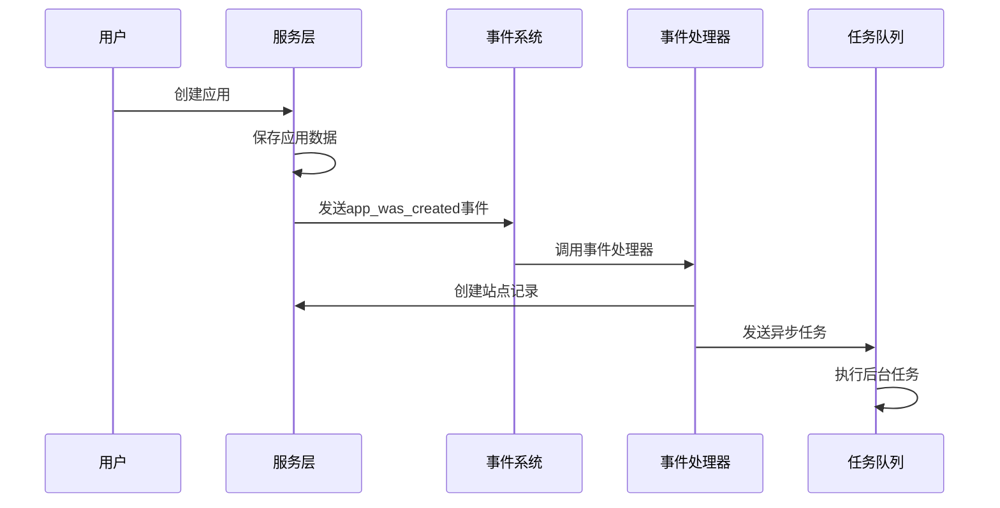

# 09-事件系统

## 概述

事件系统（`events/`）采用事件驱动架构，通过Blinker信号机制实现组件间的松耦合通信。系统定义了各种业务事件（如应用创建、消息发送、文档更新等），并提供了相应的事件处理器来响应这些事件，实现异步处理和系统解耦。

## 目录结构

```
events/
├── __init__.py                    # 事件模块初始化
├── app_event.py                   # 应用相关事件
├── dataset_event.py               # 数据集相关事件
├── document_event.py              # 文档相关事件
├── message_event.py               # 消息相关事件
├── tenant_event.py                # 租户相关事件
└── event_handlers/                # 事件处理器
    ├── __init__.py                # 处理器注册
    ├── create_site_record_when_app_created.py
    ├── create_installed_app_when_app_created.py
    ├── create_document_index.py
    ├── clean_when_dataset_deleted.py
    ├── clean_when_document_deleted.py
    ├── update_provider_when_message_created.py
    ├── update_app_dataset_join_when_app_model_config_updated.py
    ├── update_app_dataset_join_when_app_published_workflow_updated.py
    └── delete_tool_parameters_cache_when_sync_draft_workflow.py
```

## 核心文件详解

### 1. `app_event.py` - 应用事件定义

**职责**: 定义应用生命周期相关的所有事件信号。

**核心事件**:
```python
from blinker import signal

# 应用创建事件
app_was_created = signal("app-was-created")

# 应用模型配置更新事件
app_model_config_was_updated = signal("app-model-config-was-updated")

# 应用发布工作流更新事件
app_published_workflow_was_updated = signal("app-published-workflow-was-updated")

# 应用草稿工作流同步事件
app_draft_workflow_was_synced = signal("app-draft-workflow-was-synced")
```

**事件参数**:
- `sender`: 事件发送者（通常是应用对象）
- `kwargs`: 额外参数（如配置信息、工作流数据等）

### 2. `event_handlers/__init__.py` - 事件处理器注册

**职责**: 集中注册所有事件处理器，确保事件监听器正确连接。

**处理器注册**:
```python
# 清理处理器
from .clean_when_dataset_deleted import handle
from .clean_when_document_deleted import handle

# 创建处理器
from .create_document_index import handle
from .create_installed_app_when_app_created import handle
from .create_site_record_when_app_created import handle

# 更新处理器
from .update_app_dataset_join_when_app_model_config_updated import handle
from .update_app_dataset_join_when_app_published_workflow_updated import handle
from .update_provider_when_message_created import handle

# 删除处理器
from .delete_tool_parameters_cache_when_sync_draft_workflow import handle
```

### 3. 事件处理器详解

#### 3.1 应用创建处理器

**`create_site_record_when_app_created.py`**:
```python
@app_was_created.connect
def handle(sender, **kwargs):
    """应用创建时创建站点记录"""
    app = sender
    account = kwargs.get("account")
    
    if account is not None:
        site = Site(
            app_id=app.id,
            title=app.name,
            icon_type=app.icon_type,
            icon=app.icon,
            icon_background=app.icon_background,
            default_language=account.interface_language,
            customize_token_strategy="not_allow",
            code=Site.generate_code(16),
            created_by=app.created_by,
            updated_by=app.updated_by,
        )
        
        db.session.add(site)
        db.session.commit()
```

**功能**: 当应用创建时，自动创建对应的站点记录，包括站点配置、图标、语言设置等。

#### 3.2 文档索引处理器

**`create_document_index.py`**:
```python
@document_was_created.connect
def handle(sender, **kwargs):
    """文档创建时创建索引"""
    document = sender
    
    # 创建文档索引任务
    create_document_index_task.delay(
        dataset_id=document.dataset_id,
        document_id=document.id,
        action="create"
    )
```

**功能**: 当文档创建时，异步创建文档索引，支持RAG检索功能。

#### 3.3 清理处理器

**`clean_when_dataset_deleted.py`**:
```python
@dataset_was_deleted.connect
def handle(sender, **kwargs):
    """数据集删除时清理相关数据"""
    dataset = sender
    
    # 清理文档索引
    clean_document_index_task.delay(dataset_id=dataset.id)
    
    # 清理应用数据集关联
    clean_app_dataset_join_task.delay(dataset_id=dataset.id)
```

**功能**: 当数据集删除时，清理相关的索引、关联数据等，确保数据一致性。

## 事件驱动架构

### 1. 架构设计



### 2. 事件流程



### 3. 事件类型分类

**生命周期事件**:
- 应用创建/更新/删除
- 数据集创建/更新/删除
- 文档创建/更新/删除
- 消息创建/发送

**配置变更事件**:
- 模型配置更新
- 工作流发布/同步
- 工具参数缓存清理

**清理事件**:
- 数据删除时的关联清理
- 缓存失效处理
- 索引重建

## 使用示例

### 1. 发送事件

```python
from events.app_event import app_was_created

def create_app(app_data, account):
    # 创建应用
    app = App(**app_data)
    db.session.add(app)
    db.session.commit()
    
    # 发送应用创建事件
    app_was_created.send(app, account=account)
    
    return app
```

### 2. 监听事件

```python
from events.app_event import app_was_created

@app_was_created.connect
def handle_app_created(sender, **kwargs):
    """处理应用创建事件"""
    app = sender
    account = kwargs.get("account")
    
    # 执行相关业务逻辑
    create_app_analytics(app.id)
    send_notification(account, f"应用 {app.name} 创建成功")
```

### 3. 异步事件处理

```python
from events.message_event import message_was_created
from tasks.message_task import process_message_task

@message_was_created.connect
def handle_message_created(sender, **kwargs):
    """处理消息创建事件"""
    message = sender
    
    # 发送异步任务
    process_message_task.delay(
        message_id=message.id,
        app_id=message.app_id
    )
```

## 最佳实践

### 1. 事件设计原则

**单一职责**:
- 每个事件只关注一个业务操作
- 事件名称要清晰表达意图

**松耦合**:
- 事件发送者不依赖处理器
- 处理器可以独立开发和测试

**幂等性**:
- 事件处理器应该是幂等的
- 支持重复处理而不产生副作用

### 2. 错误处理

```python
@app_was_created.connect
def handle_app_created(sender, **kwargs):
    try:
        # 事件处理逻辑
        process_app_creation(sender, **kwargs)
    except Exception as e:
        # 记录错误日志
        logger.error(f"处理应用创建事件失败: {e}")
        # 可以选择重试或忽略
        raise
```

### 3. 性能优化

**异步处理**:
- 耗时操作使用异步任务
- 避免在事件处理器中执行阻塞操作

**批量处理**:
- 多个相关事件可以批量处理
- 减少数据库操作次数

### 4. 监控和调试

```python
import logging

logger = logging.getLogger(__name__)

@app_was_created.connect
def handle_app_created(sender, **kwargs):
    logger.info(f"处理应用创建事件: {sender.id}")
    # 处理逻辑
    logger.info(f"应用创建事件处理完成: {sender.id}")
```

## 扩展指南

### 添加新事件

1. **定义事件信号**:
```python
# 在相应的事件文件中添加
new_event = signal("new-event-name")
```

2. **创建事件处理器**:
```python
# 在event_handlers/中创建新文件
@new_event.connect
def handle_new_event(sender, **kwargs):
    """处理新事件"""
    # 处理逻辑
    pass
```

3. **注册处理器**:
```python
# 在event_handlers/__init__.py中导入
from .new_event_handler import handle
```

### 自定义事件总线

```python
class CustomEventBus:
    def __init__(self):
        self._signals = {}
    
    def signal(self, name):
        if name not in self._signals:
            self._signals[name] = signal(name)
        return self._signals[name]
    
    def send(self, name, sender, **kwargs):
        sig = self.signal(name)
        sig.send(sender, **kwargs)
```

## 故障排除

### 常见问题

1. **事件未触发**
   - 检查事件信号是否正确发送
   - 确认处理器是否正确注册

2. **处理器执行失败**
   - 查看错误日志
   - 检查依赖服务是否可用

3. **性能问题**
   - 监控事件处理时间
   - 考虑使用异步处理

### 调试技巧

```python
# 启用事件调试
import logging
logging.getLogger('blinker').setLevel(logging.DEBUG)

# 添加事件追踪
def trace_event(event_name):
    def decorator(func):
        def wrapper(sender, **kwargs):
            print(f"处理事件: {event_name}")
            result = func(sender, **kwargs)
            print(f"事件处理完成: {event_name}")
            return result
        return wrapper
    return decorator
```

---

*事件系统为Dify提供了灵活、可扩展的事件驱动架构，实现了组件间的松耦合通信和异步处理能力。* 