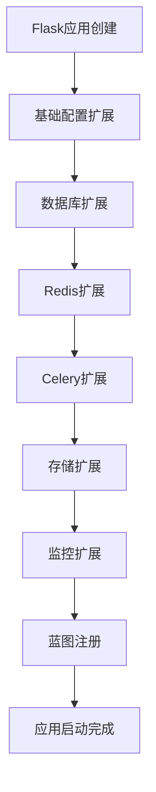

# 10-扩展系统

## 概述

扩展系统（`extensions/`）是Dify的核心扩展机制，负责初始化和配置各种第三方库和自定义功能。该层采用Flask扩展模式，通过`init_app`函数统一管理所有扩展的初始化，确保系统组件的正确配置和启动顺序。

## 目录结构

```
extensions/
├── __init__.py                    # 扩展模块初始化
├── ext_database.py                # 数据库扩展
├── ext_redis.py                   # Redis扩展
├── ext_celery.py                  # Celery任务队列扩展
├── ext_blueprints.py              # 蓝图注册扩展
├── ext_logging.py                 # 日志扩展
├── ext_mail.py                    # 邮件扩展
├── ext_login.py                   # 登录认证扩展
├── ext_storage.py                 # 存储扩展
├── ext_otel.py                    # OpenTelemetry扩展
├── ext_sentry.py                  # Sentry错误监控扩展
├── ext_app_metrics.py             # 应用指标扩展
├── ext_commands.py                # CLI命令扩展
├── ext_compress.py                # 压缩扩展
├── ext_hosting_provider.py        # 托管提供商扩展
├── ext_code_based_extension.py    # 代码扩展
├── ext_import_modules.py          # 模块导入扩展
├── ext_migrate.py                 # 迁移扩展
├── ext_proxy_fix.py               # 代理修复扩展
├── ext_request_logging.py         # 请求日志扩展
├── ext_set_secretkey.py           # 密钥设置扩展
├── ext_timezone.py                # 时区扩展
├── ext_warnings.py                # 警告扩展
└── storage/                       # 存储扩展实现
    ├── base_storage.py            # 存储基类
    ├── storage_type.py            # 存储类型定义
    ├── aws_s3_storage.py          # AWS S3存储
    ├── azure_blob_storage.py      # Azure Blob存储
    ├── google_cloud_storage.py    # Google Cloud存储
    ├── aliyun_oss_storage.py      # 阿里云OSS存储
    ├── tencent_cos_storage.py     # 腾讯云COS存储
    ├── huawei_obs_storage.py      # 华为云OBS存储
    ├── baidu_obs_storage.py       # 百度云BOS存储
    ├── volcengine_tos_storage.py  # 火山引擎TOS存储
    ├── oracle_oci_storage.py      # Oracle OCI存储
    ├── supabase_storage.py        # Supabase存储
    └── opendal_storage.py         # OpenDAL存储
```

## 核心扩展详解

### 1. `ext_database.py` - 数据库扩展

**职责**: 初始化SQLAlchemy数据库连接和配置。

**核心功能**:
```python
def init_app(app: DifyApp):
    """初始化数据库扩展"""
    # 初始化SQLAlchemy数据库实例
    # 这会根据Flask应用的配置自动设置数据库连接
    db.init_app(app)
```

**配置内容**:
- 数据库连接池配置
- 连接字符串设置
- 事务管理
- 模型注册

### 2. `ext_redis.py` - Redis扩展

**职责**: 配置Redis客户端，支持多种部署模式。

**核心组件**:
```python
class RedisClientWrapper:
    """Redis客户端包装器"""
    def __init__(self):
        self._client = None
    
    def initialize(self, client):
        """初始化Redis客户端"""
        if self._client is None:
            self._client = client
    
    def __getattr__(self, item):
        """代理属性访问到Redis客户端"""
        if self._client is None:
            raise RuntimeError("Redis client is not initialized")
        return getattr(self._client, item)
```

**支持模式**:
- 单机Redis
- Redis Sentinel（高可用）
- Redis Cluster（集群）
- SSL连接
- 客户端缓存

**配置示例**:
```python
def init_app(app: DifyApp):
    global redis_client
    
    # 选择连接类
    connection_class = SSLConnection if dify_config.REDIS_USE_SSL else Connection
    
    # 配置RESP协议版本
    resp_protocol = dify_config.REDIS_SERIALIZATION_PROTOCOL
    
    # 配置客户端缓存
    if dify_config.REDIS_ENABLE_CLIENT_SIDE_CACHE:
        if resp_protocol >= 3:
            clientside_cache_config = CacheConfig()
        else:
            raise ValueError("Client side cache is only supported in RESP3")
```

### 3. `ext_celery.py` - Celery任务队列扩展

**职责**: 配置Celery后台任务系统。

**核心功能**:
```python
class FlaskTask(Task):
    """自定义Celery任务类，支持Flask应用上下文"""
    def __call__(self, *args: object, **kwargs: object) -> object:
        with app.app_context():
            return self.run(*args, **kwargs)

def init_app(app: DifyApp) -> Celery:
    """初始化Celery扩展"""
    # 创建Celery应用实例
    celery_app = Celery(
        app.name,
        task_cls=FlaskTask,
        broker=dify_config.CELERY_BROKER_URL,
        backend=dify_config.CELERY_BACKEND,
        task_ignore_result=True,
    )
    
    # 配置定时任务
    celery_app.conf.beat_schedule = {
        'clean-expired-logs': {
            'task': 'tasks.clean_expired_logs',
            'schedule': crontab(hour=2, minute=0),  # 每天凌晨2点执行
        },
        'clean-embedding-cache': {
            'task': 'tasks.clean_embedding_cache',
            'schedule': crontab(hour=3, minute=0),  # 每天凌晨3点执行
        },
    }
    
    return celery_app
```

**配置内容**:
- 消息代理和结果后端
- SSL连接配置
- 定时任务调度
- 工作进程配置

### 4. `ext_storage.py` - 存储扩展

**职责**: 统一管理多种云存储服务。

**存储类型支持**:
- AWS S3
- Azure Blob Storage
- Google Cloud Storage
- 阿里云OSS
- 腾讯云COS
- 华为云OBS
- 百度云BOS
- 火山引擎TOS
- Oracle OCI
- Supabase
- OpenDAL

**核心接口**:
```python
class BaseStorage:
    """存储基类"""
    def __init__(self, config: dict):
        self.config = config
    
    def upload_file(self, file_path: str, target_path: str) -> str:
        """上传文件"""
        pass
    
    def download_file(self, file_path: str, target_path: str):
        """下载文件"""
        pass
    
    def delete_file(self, file_path: str):
        """删除文件"""
        pass
    
    def get_file_url(self, file_path: str, expires_in: int = 3600) -> str:
        """获取文件访问URL"""
        pass
```

### 5. `ext_otel.py` - OpenTelemetry扩展

**职责**: 配置分布式追踪和可观测性。

**功能特性**:
- 分布式追踪
- 指标收集
- 日志关联
- 性能监控

### 6. `ext_sentry.py` - Sentry错误监控扩展

**职责**: 配置错误监控和异常报告。

**配置内容**:
- 错误捕获
- 性能监控
- 用户反馈
- 环境配置

### 7. `ext_app_metrics.py` - 应用指标扩展

**职责**: 收集和导出应用性能指标。

**指标类型**:
- 请求计数
- 响应时间
- 错误率
- 资源使用率

## 扩展初始化流程

### 1. 初始化顺序



### 2. 扩展注册机制

```python
def init_extensions(app: DifyApp):
    """初始化所有扩展"""
    # 基础扩展
    ext_database.init_app(app)
    ext_redis.init_app(app)
    ext_celery.init_app(app)
    
    # 功能扩展
    ext_storage.init_app(app)
    ext_mail.init_app(app)
    ext_login.init_app(app)
    
    # 监控扩展
    ext_otel.init_app(app)
    ext_sentry.init_app(app)
    ext_app_metrics.init_app(app)
    
    # 蓝图注册
    ext_blueprints.init_app(app)
```

## 使用示例

### 1. 数据库操作

```python
from extensions.ext_database import db
from models import User

def create_user(user_data):
    user = User(**user_data)
    db.session.add(user)
    db.session.commit()
    return user
```

### 2. Redis缓存

```python
from extensions.ext_redis import redis_client

def cache_user_data(user_id: str, data: dict):
    """缓存用户数据"""
    key = f"user:{user_id}"
    redis_client.setex(key, 3600, json.dumps(data))

def get_cached_user_data(user_id: str):
    """获取缓存的用户数据"""
    key = f"user:{user_id}"
    data = redis_client.get(key)
    return json.loads(data) if data else None
```

### 3. 异步任务

```python
from extensions.ext_celery import celery_app

@celery_app.task
def process_document_async(document_id: str):
    """异步处理文档"""
    # 处理逻辑
    pass

def trigger_document_processing(document_id: str):
    """触发文档异步处理"""
    process_document_async.delay(document_id)
```

### 4. 文件存储

```python
from extensions.ext_storage import get_storage_client

def upload_user_avatar(user_id: str, file_path: str):
    """上传用户头像"""
    storage = get_storage_client()
    target_path = f"avatars/{user_id}.jpg"
    return storage.upload_file(file_path, target_path)
```

## 最佳实践

### 1. 扩展设计原则

**单一职责**:
- 每个扩展只负责一个功能领域
- 避免扩展间的强依赖

**配置驱动**:
- 通过配置文件控制扩展行为
- 支持环境特定的配置

**错误处理**:
- 扩展初始化失败不应阻止应用启动
- 提供降级和回退机制

### 2. 性能优化

**延迟初始化**:
- 按需初始化资源密集型扩展
- 避免不必要的资源消耗

**连接池管理**:
- 合理配置数据库和Redis连接池
- 监控连接使用情况

### 3. 监控和调试

**健康检查**:
```python
def check_extensions_health():
    """检查扩展健康状态"""
    health_status = {}
    
    # 检查数据库连接
    try:
        db.session.execute("SELECT 1")
        health_status["database"] = "healthy"
    except Exception as e:
        health_status["database"] = f"unhealthy: {e}"
    
    # 检查Redis连接
    try:
        redis_client.ping()
        health_status["redis"] = "healthy"
    except Exception as e:
        health_status["redis"] = f"unhealthy: {e}"
    
    return health_status
```

## 扩展指南

### 添加新扩展

1. **创建扩展文件**:
```python
# extensions/ext_new_feature.py
from dify_app import DifyApp

def init_app(app: DifyApp):
    """初始化新功能扩展"""
    # 扩展初始化逻辑
    pass
```

2. **注册扩展**:
```python
# 在应用工厂中注册
from extensions.ext_new_feature import init_app as init_new_feature

def create_app():
    app = DifyApp(__name__)
    # ... 其他扩展
    init_new_feature(app)
    return app
```

3. **配置管理**:
```python
# 在配置文件中添加相关配置
class Config:
    NEW_FEATURE_ENABLED = True
    NEW_FEATURE_CONFIG = {}
```

### 自定义存储实现

```python
# extensions/storage/custom_storage.py
from .base_storage import BaseStorage

class CustomStorage(BaseStorage):
    def __init__(self, config: dict):
        super().__init__(config)
        # 初始化自定义存储客户端
    
    def upload_file(self, file_path: str, target_path: str) -> str:
        # 实现文件上传逻辑
        pass
    
    def download_file(self, file_path: str, target_path: str):
        # 实现文件下载逻辑
        pass
```

## 故障排除

### 常见问题

1. **扩展初始化失败**
   - 检查配置文件
   - 确认依赖服务可用
   - 查看错误日志

2. **性能问题**
   - 监控扩展性能指标
   - 优化配置参数
   - 考虑使用缓存

3. **连接问题**
   - 检查网络连接
   - 验证认证信息
   - 确认服务状态

### 调试技巧

```python
import logging

logger = logging.getLogger(__name__)

def debug_extension(extension_name: str):
    """调试扩展"""
    def decorator(func):
        def wrapper(app):
            logger.info(f"初始化扩展: {extension_name}")
            try:
                result = func(app)
                logger.info(f"扩展 {extension_name} 初始化成功")
                return result
            except Exception as e:
                logger.error(f"扩展 {extension_name} 初始化失败: {e}")
                raise
        return wrapper
    return decorator
```

---

*扩展系统为Dify提供了灵活、可扩展的架构，支持多种第三方服务和自定义功能的集成。* 