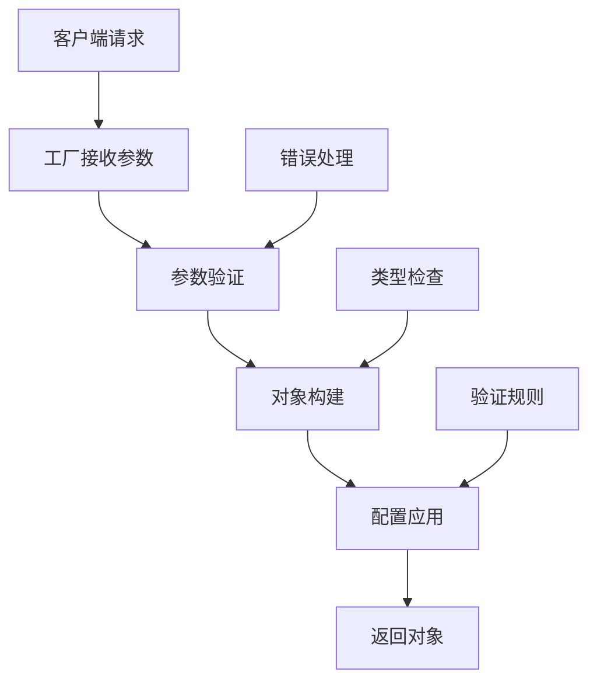

# 11-工厂模式层

## 概述

工厂模式层（`factories/`）负责创建和管理系统中的各种对象实例，采用工厂模式实现对象的统一创建、配置和生命周期管理。该层提供了智能体工厂、文件工厂、变量工厂等，确保对象创建的一致性和可维护性。

## 目录结构

```
factories/
├── __init__.py                    # 工厂模块初始化
├── agent_factory.py               # 智能体工厂
├── file_factory.py                # 文件工厂
└── variable_factory.py            # 变量工厂
```

## 核心工厂详解

### 1. `agent_factory.py` - 智能体工厂

**职责**: 创建和管理智能体策略实例。

**核心功能**:
```python
def get_plugin_agent_strategy(
    tenant_id: str, 
    agent_strategy_provider_name: str, 
    agent_strategy_name: str
) -> PluginAgentStrategy:
    """获取插件智能体策略"""
    manager = PluginAgentClient()
    agent_provider = manager.fetch_agent_strategy_provider(
        tenant_id, 
        agent_strategy_provider_name
    )
    
    for agent_strategy in agent_provider.declaration.strategies:
        if agent_strategy.identity.name == agent_strategy_name:
            return PluginAgentStrategy(
                tenant_id, 
                agent_strategy, 
                agent_provider.meta.version
            )
    
    raise ValueError(f"Agent strategy {agent_strategy_name} not found")
```

**设计特点**:
- 支持多租户隔离
- 动态策略加载
- 版本管理
- 错误处理

### 2. `file_factory.py` - 文件工厂

**职责**: 创建和管理文件对象，支持多种文件传输方式。

**核心功能**:

#### 2.1 文件构建函数

```python
def build_from_mapping(
    *,
    mapping: Mapping[str, Any],
    tenant_id: str,
    config: FileUploadConfig | None = None,
    strict_type_validation: bool = False,
) -> File:
    """从映射构建文件对象"""
    transfer_method = FileTransferMethod.value_of(mapping.get("transfer_method"))
    
    build_functions: dict[FileTransferMethod, Callable] = {
        FileTransferMethod.LOCAL_FILE: _build_from_local_file,
        FileTransferMethod.REMOTE_URL: _build_from_remote_url,
        FileTransferMethod.TOOL_FILE: _build_from_tool_file,
    }
    
    build_func = build_functions.get(transfer_method)
    if not build_func:
        raise ValueError(f"Invalid file transfer method: {transfer_method}")
    
    file: File = build_func(
        mapping=mapping,
        tenant_id=tenant_id,
        transfer_method=transfer_method,
        strict_type_validation=strict_type_validation,
    )
    
    # 文件验证
    if config and not _is_file_valid_with_config(
        input_file_type=mapping.get("type", FileType.CUSTOM),
        file_extension=file.extension or "",
        file_transfer_method=file.transfer_method,
        config=config,
    ):
        raise ValueError(f"File validation failed for file: {file.filename}")
    
    return file
```

#### 2.2 本地文件构建

```python
def _build_from_local_file(
    *,
    mapping: Mapping[str, Any],
    tenant_id: str,
    transfer_method: FileTransferMethod,
    strict_type_validation: bool = False,
) -> File:
    """从本地文件构建文件对象"""
    upload_file_id = mapping.get("upload_file_id")
    if not upload_file_id:
        raise ValueError("upload_file_id is required for local file")
    
    # 从数据库加载上传文件信息
    upload_file = db.session.get(UploadFile, upload_file_id)
    if not upload_file:
        raise ValueError(f"Upload file not found: {upload_file_id}")
    
    # 构建文件对象
    return File(
        id=str(upload_file.id),
        filename=upload_file.filename,
        type=upload_file.type,
        extension=upload_file.extension,
        mime_type=upload_file.mime_type,
        size=upload_file.size,
        transfer_method=transfer_method,
        storage_key=upload_file.storage_key,
        tenant_id=tenant_id,
    )
```

#### 2.3 远程URL文件构建

```python
def _build_from_remote_url(
    *,
    mapping: Mapping[str, Any],
    tenant_id: str,
    transfer_method: FileTransferMethod,
    strict_type_validation: bool = False,
) -> File:
    """从远程URL构建文件对象"""
    url = mapping.get("url")
    if not url:
        raise ValueError("url is required for remote file")
    
    # 获取远程文件信息
    file_info = _get_remote_file_info(url)
    
    # 构建文件对象
    return File(
        id=mapping.get("id", str(uuid.uuid4())),
        filename=file_info.filename,
        type=file_info.type,
        extension=file_info.extension,
        mime_type=file_info.mimetype,
        size=file_info.size,
        transfer_method=transfer_method,
        url=url,
        tenant_id=tenant_id,
    )
```

#### 2.4 工具文件构建

```python
def _build_from_tool_file(
    *,
    mapping: Mapping[str, Any],
    tenant_id: str,
    transfer_method: FileTransferMethod,
    strict_type_validation: bool = False,
) -> File:
    """从工具文件构建文件对象"""
    tool_file_id = mapping.get("tool_file_id")
    if not tool_file_id:
        raise ValueError("tool_file_id is required for tool file")
    
    # 从数据库加载工具文件信息
    tool_file = db.session.get(ToolFile, tool_file_id)
    if not tool_file:
        raise ValueError(f"Tool file not found: {tool_file_id}")
    
    # 构建文件对象
    return File(
        id=str(tool_file.id),
        filename=tool_file.filename,
        type=tool_file.type,
        extension=tool_file.extension,
        mime_type=tool_file.mime_type,
        size=tool_file.size,
        transfer_method=transfer_method,
        storage_key=tool_file.storage_key,
        tenant_id=tenant_id,
    )
```

#### 2.5 文件类型标准化

```python
def _standardize_file_type(*, extension: str = "", mime_type: str = "") -> FileType:
    """标准化文件类型"""
    # 优先使用扩展名判断
    if extension:
        file_type = _get_file_type_by_extension(extension)
        if file_type:
            return file_type
    
    # 使用MIME类型判断
    if mime_type:
        file_type = _get_file_type_by_mimetype(mime_type)
        if file_type:
            return file_type
    
    return FileType.CUSTOM
```

### 3. `variable_factory.py` - 变量工厂

**职责**: 创建和管理变量对象，支持多种变量类型。

**核心功能**:

#### 3.1 变量类型映射

```python
SEGMENT_TO_VARIABLE_MAP = {
    StringSegment: StringVariable,
    IntegerSegment: IntegerVariable,
    FloatSegment: FloatVariable,
    ObjectSegment: ObjectVariable,
    FileSegment: FileVariable,
    ArrayStringSegment: ArrayStringVariable,
    ArrayNumberSegment: ArrayNumberVariable,
    ArrayObjectSegment: ArrayObjectVariable,
    ArrayFileSegment: ArrayFileVariable,
    ArrayAnySegment: ArrayAnyVariable,
    NoneSegment: NoneVariable,
}
```

#### 3.2 会话变量构建

```python
def build_conversation_variable_from_mapping(mapping: Mapping[str, Any], /) -> Variable:
    """从映射构建会话变量"""
    if not mapping.get("name"):
        raise VariableError("missing name")
    return _build_variable_from_mapping(
        mapping=mapping, 
        selector=[CONVERSATION_VARIABLE_NODE_ID, mapping["name"]]
    )
```

#### 3.3 环境变量构建

```python
def build_environment_variable_from_mapping(mapping: Mapping[str, Any], /) -> Variable:
    """从映射构建环境变量"""
    if not mapping.get("name"):
        raise VariableError("missing name")
    return _build_variable_from_mapping(
        mapping=mapping, 
        selector=[ENVIRONMENT_VARIABLE_NODE_ID, mapping["name"]]
    )
```

#### 3.4 变量构建核心逻辑

```python
def _build_variable_from_mapping(*, mapping: Mapping[str, Any], selector: Sequence[str]) -> Variable:
    """从映射构建变量的核心逻辑"""
    if (value_type := mapping.get("value_type")) is None:
        raise VariableError("missing value type")
    if (value := mapping.get("value")) is None:
        raise VariableError("missing value")

    result: Variable
    match value_type:
        case SegmentType.STRING:
            result = StringVariable.model_validate(mapping)
        case SegmentType.SECRET:
            result = SecretVariable.model_validate(mapping)
        case SegmentType.NUMBER | SegmentType.INTEGER if isinstance(value, int):
            mapping = dict(mapping)
            mapping["value_type"] = SegmentType.INTEGER
            result = IntegerVariable.model_validate(mapping)
        case SegmentType.NUMBER | SegmentType.FLOAT if isinstance(value, float):
            mapping = dict(mapping)
            mapping["value_type"] = SegmentType.FLOAT
            result = FloatVariable.model_validate(mapping)
        case SegmentType.OBJECT:
            result = ObjectVariable.model_validate(mapping)
        case SegmentType.FILE:
            result = FileVariable.model_validate(mapping)
        case SegmentType.ARRAY_STRING:
            result = ArrayStringVariable.model_validate(mapping)
        case SegmentType.ARRAY_NUMBER:
            result = ArrayNumberVariable.model_validate(mapping)
        case SegmentType.ARRAY_OBJECT:
            result = ArrayObjectVariable.model_validate(mapping)
        case SegmentType.ARRAY_FILE:
            result = ArrayFileVariable.model_validate(mapping)
        case SegmentType.ARRAY_ANY:
            result = ArrayAnyVariable.model_validate(mapping)
        case _:
            raise VariableError(f"unsupported value type: {value_type}")

    result.selector = selector
    return result
```

#### 3.5 段构建

```python
def build_segment(value: Any, /) -> Segment:
    """构建段对象"""
    segment_type = infer_segment_type_from_value(value)
    return build_segment_with_type(segment_type, value)

def build_segment_with_type(segment_type: SegmentType, value: Any) -> Segment:
    """根据类型构建段对象"""
    match segment_type:
        case SegmentType.STRING:
            return StringSegment(value=value)
        case SegmentType.INTEGER:
            return IntegerSegment(value=value)
        case SegmentType.FLOAT:
            return FloatSegment(value=value)
        case SegmentType.OBJECT:
            return ObjectSegment(value=value)
        case SegmentType.FILE:
            return FileSegment(value=value)
        case SegmentType.ARRAY_STRING:
            return ArrayStringSegment(value=value)
        case SegmentType.ARRAY_NUMBER:
            return ArrayNumberSegment(value=value)
        case SegmentType.ARRAY_OBJECT:
            return ArrayObjectSegment(value=value)
        case SegmentType.ARRAY_FILE:
            return ArrayFileSegment(value=value)
        case SegmentType.ARRAY_ANY:
            return ArrayAnySegment(value=value)
        case SegmentType.NONE:
            return NoneSegment(value=value)
        case _:
            raise UnsupportedSegmentTypeError(f"unsupported segment type: {segment_type}")
```

## 工厂模式设计

### 1. 设计原则

**单一职责**:
- 每个工厂只负责创建特定类型的对象
- 避免工厂间的相互依赖

**开闭原则**:
- 支持扩展新的对象类型
- 不需要修改现有工厂代码

**依赖注入**:
- 通过参数传递依赖
- 支持配置驱动的对象创建

### 2. 对象创建流程



### 3. 错误处理机制

```python
class VariableError(Exception):
    """变量相关错误"""
    pass

class UnsupportedSegmentTypeError(Exception):
    """不支持的段类型错误"""
    pass

class TypeMismatchError(Exception):
    """类型不匹配错误"""
    pass
```

## 使用示例

### 1. 智能体工厂使用

```python
from factories.agent_factory import get_plugin_agent_strategy

def create_agent(tenant_id: str, provider_name: str, strategy_name: str):
    """创建智能体"""
    try:
        strategy = get_plugin_agent_strategy(
            tenant_id=tenant_id,
            agent_strategy_provider_name=provider_name,
            agent_strategy_name=strategy_name
        )
        return strategy
    except ValueError as e:
        logger.error(f"创建智能体失败: {e}")
        raise
```

### 2. 文件工厂使用

```python
from factories.file_factory import build_from_mapping

def create_file_from_upload(upload_file_id: str, tenant_id: str):
    """从上传文件创建文件对象"""
    mapping = {
        "upload_file_id": upload_file_id,
        "transfer_method": "local_file"
    }
    
    config = FileUploadConfig(
        max_file_size=10 * 1024 * 1024,  # 10MB
        allowed_file_types=["image", "document"]
    )
    
    return build_from_mapping(
        mapping=mapping,
        tenant_id=tenant_id,
        config=config
    )

def create_file_from_url(url: str, tenant_id: str):
    """从URL创建文件对象"""
    mapping = {
        "url": url,
        "transfer_method": "remote_url"
    }
    
    return build_from_mapping(
        mapping=mapping,
        tenant_id=tenant_id
    )
```

### 3. 变量工厂使用

```python
from factories.variable_factory import (
    build_conversation_variable_from_mapping,
    build_environment_variable_from_mapping
)

def create_conversation_variable(name: str, value: str):
    """创建会话变量"""
    mapping = {
        "name": name,
        "value": value,
        "value_type": "string"
    }
    
    return build_conversation_variable_from_mapping(mapping)

def create_environment_variable(name: str, value: int):
    """创建环境变量"""
    mapping = {
        "name": name,
        "value": value,
        "value_type": "integer"
    }
    
    return build_environment_variable_from_mapping(mapping)
```

## 最佳实践

### 1. 工厂设计原则

**配置驱动**:
- 通过配置文件控制对象创建
- 支持环境特定的配置

**类型安全**:
- 使用类型注解确保类型安全
- 提供运行时类型检查

**错误处理**:
- 提供详细的错误信息
- 支持优雅的错误恢复

### 2. 性能优化

**对象缓存**:
```python
class CachedFactory:
    def __init__(self):
        self._cache = {}
    
    def get_or_create(self, key: str, creator_func: Callable):
        if key not in self._cache:
            self._cache[key] = creator_func()
        return self._cache[key]
```

**批量创建**:
```python
def build_multiple_files(mappings: List[Dict], tenant_id: str) -> List[File]:
    """批量创建文件对象"""
    return [
        build_from_mapping(mapping, tenant_id)
        for mapping in mappings
    ]
```

### 3. 测试支持

```python
class MockFileFactory:
    """文件工厂的Mock实现"""
    def build_from_mapping(self, mapping, tenant_id):
        return File(
            id=mapping.get("id", "mock-id"),
            filename=mapping.get("filename", "mock.txt"),
            type=FileType.CUSTOM,
            tenant_id=tenant_id
        )
```

## 扩展指南

### 添加新工厂

1. **创建工厂文件**:
```python
# factories/new_factory.py
from typing import Any, Mapping

def build_new_object(mapping: Mapping[str, Any]) -> NewObject:
    """构建新对象"""
    # 验证参数
    if not mapping.get("required_field"):
        raise ValueError("required_field is required")
    
    # 构建对象
    return NewObject(**mapping)
```

2. **注册工厂**:
```python
# 在__init__.py中导入
from .new_factory import build_new_object
```

3. **添加测试**:
```python
def test_build_new_object():
    mapping = {"required_field": "value"}
    obj = build_new_object(mapping)
    assert obj.required_field == "value"
```

### 自定义对象创建

```python
class CustomObjectFactory:
    def __init__(self, config: dict):
        self.config = config
    
    def create_object(self, object_type: str, **kwargs):
        """创建自定义对象"""
        if object_type == "type_a":
            return TypeAObject(**kwargs, config=self.config)
        elif object_type == "type_b":
            return TypeBObject(**kwargs, config=self.config)
        else:
            raise ValueError(f"Unknown object type: {object_type}")
```

## 故障排除

### 常见问题

1. **对象创建失败**
   - 检查参数完整性
   - 验证配置正确性
   - 查看错误日志

2. **类型不匹配**
   - 确认参数类型
   - 检查类型转换逻辑
   - 验证类型注解

3. **性能问题**
   - 考虑对象缓存
   - 优化创建逻辑
   - 使用批量创建

### 调试技巧

```python
import logging

logger = logging.getLogger(__name__)

def debug_factory(factory_name: str):
    """调试工厂函数"""
    def decorator(func):
        def wrapper(*args, **kwargs):
            logger.debug(f"调用工厂: {factory_name}, 参数: {args}, {kwargs}")
            try:
                result = func(*args, **kwargs)
                logger.debug(f"工厂 {factory_name} 创建成功: {result}")
                return result
            except Exception as e:
                logger.error(f"工厂 {factory_name} 创建失败: {e}")
                raise
        return wrapper
    return decorator
```

---

*工厂模式层为Dify提供了统一、灵活的对象创建机制，确保系统组件的正确初始化和配置。* 