# Dify 数据库关系图

## 完整实体关系图

```mermaid
erDiagram
    %% 账户与租户关系
    Account ||--o{ TenantAccountJoin : "has"
    Tenant ||--o{ TenantAccountJoin : "belongs to"
    Account ||--o{ AccountIntegrate : "integrates"
    
    %% 租户相关关系
    Tenant ||--o{ TenantPluginPermission : "has permissions"
    Tenant ||--o{ TenantPluginAutoUpgradeStrategy : "has strategy"
    
    %% 应用相关关系
    Tenant ||--o{ App : "owns"
    App ||--o{ AppModelConfig : "configured by"
    App ||--o{ Conversation : "has"
    App ||--o{ Site : "has site"
    App ||--o{ Workflow : "contains"
    App ||--o{ SavedMessage : "stores"
    App ||--o{ PinnedConversation : "pins"
    App ||--o{ ApiToken : "secured by"
    App ||--o{ UploadFile : "uses"
    App ||--o{ AppMCPServer : "connects to"
    
    %% 会话与消息关系
    Conversation ||--o{ Message : "contains"
    Message ||--o{ MessageAgentThought : "has thoughts"
    Message ||--o{ MessageFile : "has files"
    Message ||--o{ MessageAnnotation : "annotated"
    Message ||--o{ MessageFeedback : "has feedback"
    Message ||--o{ SavedMessage : "can be saved"
    Message ||--o{ MessageChain : "chained"
    
    %% 数据集相关关系
    Tenant ||--o{ Dataset : "manages"
    Dataset ||--o{ Document : "contains"
    Document ||--o{ DocumentSegment : "segments"
    Dataset ||--o{ AppDatasetJoin : "joined by"
    App ||--o{ AppDatasetJoin : "uses"
    Dataset ||--o{ DatasetProcessRule : "follows"
    Dataset ||--o{ DatasetQuery : "queried"
    Dataset ||--o{ DatasetPermission : "controls access"
    Dataset ||--o{ DatasetKeywordTable : "has keywords"
    Dataset ||--o{ DatasetCollectionBinding : "binds collection"
    Dataset ||--o{ ExternalKnowledgeBindings : "external knowledge"
    
    %% 工作流相关关系
    Workflow ||--o{ WorkflowRun : "executes"
    WorkflowRun ||--o{ WorkflowNodeExecutionModel : "runs nodes"
    App ||--o{ ConversationVariable : "has variables"
    Conversation ||--o{ ConversationVariable : "stores variables"
    App ||--o{ WorkflowAppLog : "logs workflow"
    
    %% 模型提供商关系
    Tenant ||--o{ Provider : "configures"
    Tenant ||--o{ ProviderModel : "uses"
    Tenant ||--o{ TenantDefaultModel : "sets default"
    Tenant ||--o{ TenantPreferredModelProvider : "prefers"
    Provider ||--o{ ProviderOrder : "orders"
    Tenant ||--o{ LoadBalancingModelConfig : "load balances"
    
    %% 工具相关关系
    Tenant ||--o{ ApiToolProvider : "creates"
    Tenant ||--o{ BuiltinToolProvider : "configures"
    Tenant ||--o{ WorkflowToolProvider : "develops"
    Account ||--o{ ApiToolProvider : "authors"
    Account ||--o{ BuiltinToolProvider : "sets up"
    Account ||--o{ ToolFile : "uploads"
    
    %% OAuth工具关系
    ToolOAuthSystemClient ||--o{ ToolOAuthTenantClient : "extends to tenant"
    
    %% 数据源关系
    Tenant ||--o{ DataSourceOauthBinding : "binds"
    Tenant ||--o{ DataSourceApiKeyAuthBinding : "authenticates"
    
    %% 扩展关系
    Tenant ||--o{ APIBasedExtension : "extends"
    
    %% 标签关系
    Tenant ||--o{ Tag : "creates"
    Tag ||--o{ TagBinding : "binds to"
    
    %% 用户关系
    Tenant ||--o{ EndUser : "serves"
    
    %% API关系
    ApiToken ||--o{ ApiRequest : "authorizes"
    
    %% 追踪关系
    App ||--o{ TraceAppConfig : "traces"
    
    %% 标注关系
    App ||--o{ AppAnnotationSetting : "annotation settings"
    App ||--o{ AppAnnotationHitHistory : "annotation hits"
    
    %% 推荐应用
    App ||--o{ RecommendedApp : "recommended"
    App ||--o{ InstalledApp : "installed"
    
    %% 实体定义
    Account {
        string id PK
        string name
        string email
        string password
        string password_salt
        string avatar
        string interface_language
        string interface_theme
        string timezone
        datetime last_login_at
        string last_login_ip
        datetime last_active_at
        string status
        datetime initialized_at
        datetime created_at
        datetime updated_at
    }
    
    Tenant {
        string id PK
        string name
        text encrypt_public_key
        string plan
        string status
        text custom_config
        datetime created_at
        datetime updated_at
    }
    
    TenantAccountJoin {
        string id PK
        string tenant_id FK
        string account_id FK
        boolean current
        string role
        string invited_by FK
        datetime created_at
        datetime updated_at
    }
    
    App {
        string id PK
        string tenant_id FK
        string name
        text description
        string mode
        string icon_type
        string icon
        string icon_background
        string app_model_config_id FK
        string workflow_id FK
        string status
        boolean enable_site
        boolean enable_api
        integer api_rpm
        integer api_rph
        boolean is_demo
        boolean is_public
        boolean is_universal
        text tracing
        integer max_active_requests
        boolean use_icon_as_answer_icon
        string created_by FK
        datetime created_at
        string updated_by FK
        datetime updated_at
    }
    
    Conversation {
        string id PK
        string app_id FK
        string app_model_config_id FK
        string model_provider
        text override_model_configs
        string model_id
        string mode
        string name
        text summary
        text inputs
        text introduction
        text system_instruction
        integer system_instruction_tokens
        string status
        string from_source
        string from_end_user_id FK
        string from_account_id FK
        datetime read_at
        string read_account_id FK
        datetime created_at
        datetime updated_at
    }
    
    Message {
        string id PK
        string app_id FK
        string model_provider
        string model_id
        text override_model_configs
        string conversation_id FK
        text inputs
        text query
        text message
        integer message_tokens
        decimal message_unit_price
        string message_price_unit
        text answer
        integer answer_tokens
        decimal answer_unit_price
        string answer_price_unit
        float provider_response_latency
        decimal total_price
        string currency
        string from_source
        string from_end_user_id FK
        string from_account_id FK
        datetime created_at
        datetime updated_at
        boolean agent_based
        string workflow_run_id FK
        string status
        text error
        text message_metadata
        string invoke_from
    }
    
    Dataset {
        string id PK
        string tenant_id FK
        string name
        text description
        string provider
        string permission
        string data_source_type
        string indexing_technique
        text index_struct
        string embedding_model
        string embedding_model_provider
        string collection_binding_id FK
        jsonb retrieval_model
        boolean built_in_field_enabled
        string created_by FK
        datetime created_at
        string updated_by FK
        datetime updated_at
    }
    
    Document {
        string id PK
        string tenant_id FK
        string dataset_id FK
        integer position
        string data_source_type
        text data_source_info
        string dataset_process_rule_id FK
        string batch
        string name
        string created_from
        string created_by FK
        string created_api_request_id FK
        datetime processing_started_at
        datetime parsing_completed_at
        datetime cleaning_completed_at
        datetime splitting_completed_at
        integer tokens
        string indexing_status
        text error
        boolean enabled
        datetime disabled_at
        string disabled_by FK
        boolean archived
        string archived_reason
        string archived_by FK
        datetime archived_at
        datetime created_at
        datetime updated_at
        string doc_type
        text doc_metadata
        string doc_form
        string doc_language
        integer word_count
        text parsing_rule
    }
    
    DocumentSegment {
        string id PK
        string tenant_id FK
        string dataset_id FK
        string document_id FK
        integer position
        text content
        text answer
        integer word_count
        integer tokens
        text keywords
        string index_node_id
        string index_node_hash
        integer hit_count
        boolean enabled
        datetime disabled_at
        string disabled_by FK
        string status
        string created_by FK
        datetime created_at
        datetime indexing_at
        datetime completed_at
        text error
        datetime stopped_at
    }
    
    Workflow {
        string id PK
        string tenant_id FK
        string app_id FK
        string type
        string version
        string marked_name
        string marked_comment
        text graph
        text features
        text environment_variables
        text conversation_variables
        string created_by FK
        datetime created_at
        string updated_by FK
        datetime updated_at
    }
    
    WorkflowRun {
        string id PK
        string tenant_id FK
        string app_id FK
        string workflow_id FK
        string triggered_from
        string workflow_snapshot_id FK
        text inputs
        string status
        text outputs
        text error
        float elapsed_time
        integer total_tokens
        integer total_steps
        string created_by_role
        string created_by FK
        datetime created_at
        datetime finished_at
    }
    
    Provider {
        string id PK
        string tenant_id FK
        string provider_name
        string provider_type
        text encrypted_config
        boolean is_valid
        datetime last_used
        string quota_type
        bigint quota_limit
        bigint quota_used
        datetime created_at
        datetime updated_at
    }
    
    ApiToolProvider {
        string id PK
        string name
        string icon
        text schema
        string schema_type_str
        string user_id FK
        string tenant_id FK
        text description
        text tools_str
        text credentials_str
        string privacy_policy
        text custom_disclaimer
        datetime created_at
        datetime updated_at
    }
    
    BuiltinToolProvider {
        string id PK
        string name
        string tenant_id FK
        string user_id FK
        string provider
        text encrypted_credentials
        boolean is_default
        string credential_type
        bigint expires_at
        datetime created_at
        datetime updated_at
    }
    
    SavedMessage {
        string id PK
        string app_id FK
        string message_id FK
        string created_by_role
        string created_by FK
        datetime created_at
    }
    
    PinnedConversation {
        string id PK
        string app_id FK
        string conversation_id FK
        string created_by_role
        string created_by FK
        datetime created_at
    }
    
    DataSourceOauthBinding {
        string id PK
        string tenant_id FK
        string access_token
        string provider
        jsonb source_info
        boolean disabled
        datetime created_at
        datetime updated_at
    }
    
    DataSourceApiKeyAuthBinding {
        string id PK
        string tenant_id FK
        string category
        string provider
        text credentials
        boolean disabled
        datetime created_at
        datetime updated_at
    }
    
    APIBasedExtension {
        string id PK
        string tenant_id FK
        string name
        string api_endpoint
        text api_key
        datetime created_at
    }
    
    Tag {
        string id PK
        string tenant_id FK
        string type
        string name
        string created_by FK
        datetime created_at
        datetime updated_at
    }
    
    TagBinding {
        string id PK
        string tenant_id FK
        string tag_id FK
        string target_id
        string created_by FK
        datetime created_at
        datetime updated_at
    }
    
    EndUser {
        string id PK
        string tenant_id FK
        string app_id FK
        string type
        string external_user_id
        string name
        boolean is_anonymous
        string session_id
        datetime created_at
        datetime updated_at
    }
    
    ApiToken {
        string id PK
        string app_id FK
        string dataset_id FK
        string type
        string token
        datetime last_used_at
        datetime created_at
    }
    
    ApiRequest {
        string id PK
        string tenant_id FK
        string api_token_id FK
        string path
        text request
        text response
        string ip
        text user_agent
        datetime created_at
    }
    
    CeleryTask {
        integer id PK
        string task_id
        string status
        pickle result
        datetime date_done
        text traceback
        string name
        binary args
        binary kwargs
        string worker
        integer retries
        string queue
    }
    
    UploadFile {
        string id PK
        string tenant_id FK
        string storage_type
        string key
        string name
        integer size
        string extension
        string mime_type
        string created_by FK
        datetime created_at
        boolean used
        string used_by FK
        datetime used_at
    }
```

## 关系说明

### 多租户架构
- 每个租户 (Tenant) 拥有独立的数据空间
- 用户 (Account) 可以属于多个租户，通过 TenantAccountJoin 管理关联关系
- 几乎所有业务表都包含 tenant_id 字段进行数据隔离

### 应用生态
- App 是核心实体，支持多种模式 (聊天、工作流、智能体等)
- 每个应用可以有多个会话 (Conversation)，每个会话包含多条消息 (Message)
- 应用可以关联数据集 (Dataset) 提供知识库支持
- 工作流 (Workflow) 提供可视化编排能力

### 数据管理
- Dataset 管理知识库，包含多个文档 (Document)
- 文档被分割为多个段落 (DocumentSegment) 用于向量检索
- 支持外部知识源集成

### 工具系统
- 支持三种工具类型：API工具、内置工具、工作流工具
- 每种工具都有独立的提供商管理
- 支持 OAuth 认证和 API 密钥认证

### 模型集成
- Provider 管理 AI 模型提供商
- 支持多种模型类型和负载均衡配置
- 租户级别的默认模型设置

## 使用说明

1. **复制图表**: 可以直接复制 Mermaid 代码到支持的编辑器中查看
2. **在线查看**: 访问 [Mermaid Live Editor](https://mermaid-js.github.io/mermaid-live-editor/) 粘贴代码
3. **导出**: 支持导出为 SVG、PNG 等格式

## 图表特点

- **完整性**: 包含所有核心表和关系
- **可读性**: 使用清晰的命名和分组
- **准确性**: 基于实际代码模型生成
- **实用性**: 支持开发和运维使用