# Dify 数据库表结构及关系

## 概述

Dify 是一个基于 Flask 的 AI 应用开发平台，采用 PostgreSQL 作为主数据库，使用 SQLAlchemy ORM 进行数据库操作。本文档详细描述了 Dify 项目中的所有数据库实体结构和字段定义。

## 数据库实体表格

### 1. 系统配置相关

#### DifySetup - 系统初始化配置
| 字段名 | 类型 | 是否必填 | 默认值 | 描述 |
|--------|------|----------|--------|---------|
| version | String(255) | 是 | - | Dify 系统版本号 |
| setup_at | DateTime | 是 | CURRENT_TIMESTAMP | 系统初始化时间 |

### 2. 账户与租户管理

#### Account - 用户账户
| 字段名 | 类型 | 是否必填 | 默认值 | 描述 |
|--------|------|----------|--------|---------|
| id | StringUUID | 是 | uuid_generate_v4() | 账户唯一标识 |
| name | String(255) | 是 | - | 用户姓名 |
| email | String(255) | 是 | - | 邮箱地址 |
| password | String(255) | 否 | - | 密码哈希 |
| password_salt | String(255) | 否 | - | 密码盐值 |
| avatar | String(255) | 否 | - | 头像URL |
| interface_language | String(255) | 否 | - | 界面语言 |
| interface_theme | String(255) | 否 | - | 界面主题 |
| timezone | String(255) | 否 | - | 时区设置 |
| last_login_at | DateTime | 否 | - | 最后登录时间 |
| last_login_ip | String(255) | 否 | - | 最后登录IP |
| last_active_at | DateTime | 是 | CURRENT_TIMESTAMP | 最后活跃时间 |
| status | String(16) | 是 | active | 账户状态 |
| initialized_at | DateTime | 否 | - | 初始化时间 |
| created_at | DateTime | 是 | CURRENT_TIMESTAMP | 创建时间 |
| updated_at | DateTime | 是 | CURRENT_TIMESTAMP | 更新时间 |

#### Tenant - 租户
| 字段名 | 类型 | 是否必填 | 默认值 | 描述 |
|--------|------|----------|--------|---------|
| id | StringUUID | 是 | uuid_generate_v4() | 租户唯一标识 |
| name | String(255) | 是 | - | 租户名称 |
| encrypt_public_key | Text | 否 | - | 加密公钥 |
| plan | String(255) | 是 | basic | 订阅计划 |
| status | String(255) | 是 | normal | 租户状态 |
| custom_config | Text | 否 | - | 自定义配置JSON |
| created_at | DateTime | 是 | CURRENT_TIMESTAMP | 创建时间 |
| updated_at | DateTime | 是 | CURRENT_TIMESTAMP | 更新时间 |

#### TenantAccountJoin - 租户账户关联
| 字段名 | 类型 | 是否必填 | 默认值 | 描述 |
|--------|------|----------|--------|---------|
| id | StringUUID | 是 | uuid_generate_v4() | 关联唯一标识 |
| tenant_id | StringUUID | 是 | - | 租户ID |
| account_id | StringUUID | 是 | - | 账户ID |
| current | Boolean | 是 | false | 是否为当前租户 |
| role | String(16) | 是 | normal | 用户角色 |
| invited_by | StringUUID | 否 | - | 邀请人ID |
| created_at | DateTime | 是 | CURRENT_TIMESTAMP | 创建时间 |
| updated_at | DateTime | 是 | CURRENT_TIMESTAMP | 更新时间 |

#### AccountIntegrate - 账户集成
| 字段名 | 类型 | 是否必填 | 默认值 | 描述 |
|--------|------|----------|--------|---------|
| id | StringUUID | 是 | uuid_generate_v4() | 集成唯一标识 |
| account_id | StringUUID | 是 | - | 账户ID |
| provider | String(16) | 是 | - | 提供商名称 |
| open_id | String(255) | 是 | - | 开放ID |
| encrypted_token | String(255) | 是 | - | 加密令牌 |
| created_at | DateTime | 是 | CURRENT_TIMESTAMP | 创建时间 |
| updated_at | DateTime | 是 | CURRENT_TIMESTAMP | 更新时间 |

#### InvitationCode - 邀请码
| 字段名 | 类型 | 是否必填 | 默认值 | 描述 |
|--------|------|----------|--------|---------|
| id | Integer | 是 | 自增 | 邀请码ID |
| batch | String(255) | 是 | - | 批次标识 |
| code | String(32) | 是 | - | 邀请码 |
| status | String(16) | 是 | unused | 使用状态 |
| used_at | DateTime | 否 | - | 使用时间 |
| used_by_tenant_id | StringUUID | 否 | - | 使用租户ID |
| used_by_account_id | StringUUID | 否 | - | 使用账户ID |
| deprecated_at | DateTime | 否 | - | 废弃时间 |
| created_at | DateTime | 是 | CURRENT_TIMESTAMP | 创建时间 |

#### TenantPluginPermission - 租户插件权限
| 字段名 | 类型 | 是否必填 | 默认值 | 描述 |
|--------|------|----------|--------|---------|
| id | StringUUID | 是 | uuid_generate_v4() | 权限唯一标识 |
| tenant_id | StringUUID | 是 | - | 租户ID |
| install_permission | String(16) | 是 | everyone | 安装权限 |
| debug_permission | String(16) | 是 | noone | 调试权限 |

#### TenantPluginAutoUpgradeStrategy - 租户插件自动升级策略
| 字段名 | 类型 | 是否必填 | 默认值 | 描述 |
|--------|------|----------|--------|---------|
| id | StringUUID | 是 | uuid_generate_v4() | 策略唯一标识 |
| tenant_id | StringUUID | 是 | - | 租户ID |
| strategy_setting | String(16) | 是 | fix_only | 策略设置 |
| upgrade_time_of_day | Integer | 是 | 0 | 升级时间（秒） |
| upgrade_mode | String(16) | 是 | exclude | 升级模式 |
| exclude_plugins | Array[String] | 是 | - | 排除插件列表 |
| include_plugins | Array[String] | 是 | - | 包含插件列表 |
| created_at | DateTime | 是 | CURRENT_TIMESTAMP | 创建时间 |
| updated_at | DateTime | 是 | CURRENT_TIMESTAMP | 更新时间 |

### 3. 应用管理

#### App - 应用
| 字段名 | 类型 | 是否必填 | 默认值 | 描述 |
|--------|------|----------|--------|---------|
| id | StringUUID | 是 | uuid_generate_v4() | 应用唯一标识 |
| tenant_id | StringUUID | 是 | - | 租户ID |
| name | String(255) | 是 | - | 应用名称 |
| description | Text | 否 | - | 应用描述 |
| mode | String(255) | 是 | - | 应用模式 |
| icon_type | String(255) | 否 | - | 图标类型 |
| icon | String(255) | 否 | - | 应用图标 |
| icon_background | String(255) | 否 | - | 图标背景色 |
| app_model_config_id | StringUUID | 否 | - | 应用模型配置ID |
| workflow_id | StringUUID | 否 | - | 工作流ID |
| status | String(255) | 是 | normal | 应用状态 |
| enable_site | Boolean | 是 | - | 是否启用站点 |
| enable_api | Boolean | 是 | - | 是否启用API |
| api_rpm | Integer | 是 | 0 | API每分钟请求限制 |
| api_rph | Integer | 是 | 0 | API每小时请求限制 |
| is_demo | Boolean | 是 | false | 是否为演示应用 |
| is_public | Boolean | 是 | false | 是否公开 |
| is_universal | Boolean | 是 | false | 是否通用 |
| tracing | Text | 否 | - | 追踪配置 |
| max_active_requests | Integer | 否 | - | 最大活跃请求数 |
| use_icon_as_answer_icon | Boolean | 是 | false | 是否使用图标作为答案图标 |
| created_by | StringUUID | 否 | - | 创建者ID |
| created_at | DateTime | 是 | CURRENT_TIMESTAMP | 创建时间 |
| updated_by | StringUUID | 否 | - | 更新者ID |
| updated_at | DateTime | 是 | CURRENT_TIMESTAMP | 更新时间 |

#### AppModelConfig - 应用模型配置
| 字段名 | 类型 | 是否必填 | 默认值 | 描述 |
|--------|------|----------|--------|---------|
| id | StringUUID | 是 | uuid_generate_v4() | 配置唯一标识 |
| app_id | StringUUID | 是 | - | 应用ID |
| provider | String(255) | 否 | - | 模型提供商 |
| model_id | String(255) | 否 | - | 模型ID |
| configs | Text | 否 | - | 配置参数JSON |
| created_at | DateTime | 是 | CURRENT_TIMESTAMP | 创建时间 |
| updated_at | DateTime | 是 | CURRENT_TIMESTAMP | 更新时间 |

#### Conversation - 会话
| 字段名 | 类型 | 是否必填 | 默认值 | 描述 |
|--------|------|----------|--------|---------|
| id | StringUUID | 是 | uuid_generate_v4() | 会话唯一标识 |
| app_id | StringUUID | 是 | - | 应用ID |
| app_model_config_id | StringUUID | 否 | - | 应用模型配置ID |
| model_provider | String(255) | 否 | - | 模型提供商 |
| override_model_configs | Text | 否 | - | 覆盖模型配置JSON |
| model_id | String(255) | 否 | - | 模型ID |
| mode | String(255) | 是 | - | 会话模式 |
| name | String(255) | 是 | - | 会话名称 |
| summary | Text | 否 | - | 会话摘要 |
| inputs | Text | 否 | - | 输入参数JSON |
| introduction | Text | 否 | - | 会话介绍 |
| system_instruction | Text | 否 | - | 系统指令 |
| system_instruction_tokens | Integer | 是 | 0 | 系统指令token数 |
| status | String(255) | 是 | normal | 会话状态 |
| from_source | String(255) | 是 | - | 来源 |
| from_end_user_id | StringUUID | 否 | - | 终端用户ID |
| from_account_id | StringUUID | 否 | - | 账户ID |
| read_at | DateTime | 否 | - | 已读时间 |
| read_account_id | StringUUID | 否 | - | 已读账户ID |
| created_at | DateTime | 是 | CURRENT_TIMESTAMP | 创建时间 |
| updated_at | DateTime | 是 | CURRENT_TIMESTAMP | 更新时间 |

#### Message - 消息
| 字段名 | 类型 | 是否必填 | 默认值 | 描述 |
|--------|------|----------|--------|---------|
| id | StringUUID | 是 | uuid_generate_v4() | 消息唯一标识 |
| app_id | StringUUID | 是 | - | 应用ID |
| model_provider | String(255) | 否 | - | 模型提供商 |
| model_id | String(255) | 否 | - | 模型ID |
| override_model_configs | Text | 否 | - | 覆盖模型配置 |
| conversation_id | StringUUID | 否 | - | 会话ID |
| inputs | Text | 否 | - | 输入内容 |
| query | Text | 是 | - | 查询内容 |
| message | Text | 是 | - | 消息内容 |
| message_tokens | Integer | 是 | 0 | 消息token数 |
| message_unit_price | Numeric | 是 | 0 | 消息单价 |
| message_price_unit | String(255) | 是 | 0.001 | 消息价格单位 |
| answer | Text | 是 | - | 回答内容 |
| answer_tokens | Integer | 是 | 0 | 回答token数 |
| answer_unit_price | Numeric | 是 | 0 | 回答单价 |
| answer_price_unit | String(255) | 是 | 0.001 | 回答价格单位 |
| provider_response_latency | Float | 是 | 0 | 提供商响应延迟 |
| total_price | Numeric | 否 | - | 总价格 |
| currency | String(255) | 否 | - | 货币类型 |
| from_source | String(255) | 是 | - | 消息来源 |
| from_end_user_id | StringUUID | 否 | - | 终端用户ID |
| from_account_id | StringUUID | 否 | - | 账户ID |
| created_at | DateTime | 是 | CURRENT_TIMESTAMP | 创建时间 |
| updated_at | DateTime | 是 | CURRENT_TIMESTAMP | 更新时间 |
| agent_based | Boolean | 是 | false | 是否基于代理 |
| workflow_run_id | StringUUID | 否 | - | 工作流运行ID |
| status | String(255) | 是 | normal | 消息状态 |
| error | Text | 否 | - | 错误信息 |
| message_metadata | Text | 否 | - | 消息元数据 |
| invoke_from | String(255) | 否 | - | 调用来源 |

#### MessageAgentThought - 消息代理思考
| 字段名 | 类型 | 是否必填 | 默认值 | 描述 |
|--------|------|----------|--------|---------|
| id | StringUUID | 是 | uuid_generate_v4() | 思考唯一标识 |
| message_id | StringUUID | 是 | - | 消息ID |
| message_chain_id | StringUUID | 否 | - | 消息链ID |
| position | Integer | 是 | - | 位置 |
| thought | Text | 否 | - | 思考内容 |
| tool | Text | 否 | - | 工具信息 |
| tool_input | Text | 否 | - | 工具输入 |
| observation | Text | 否 | - | 观察结果 |
| tool_process_data | Text | 否 | - | 工具处理数据 |
| message_token | Integer | 是 | 0 | 消息token数 |
| message_unit_price | Numeric | 是 | 0 | 消息单价 |
| answer_token | Integer | 是 | 0 | 回答token数 |
| answer_unit_price | Numeric | 是 | 0 | 回答单价 |
| latency | Float | 否 | - | 延迟 |
| tokens | Integer | 是 | 0 | token总数 |
| total_price | Numeric | 是 | 0 | 总价格 |
| currency | String(255) | 否 | - | 货币类型 |
| files | Text | 否 | - | 文件列表 |
| created_at | DateTime | 是 | CURRENT_TIMESTAMP | 创建时间 |
| updated_at | DateTime | 是 | CURRENT_TIMESTAMP | 更新时间 |

#### Site - 站点
| 字段名 | 类型 | 是否必填 | 默认值 | 描述 |
|--------|------|----------|--------|---------|
| id | StringUUID | 是 | uuid_generate_v4() | 站点唯一标识 |
| app_id | StringUUID | 是 | - | 应用ID |
| title | String(255) | 是 | - | 站点标题 |
| icon | String(255) | 否 | - | 站点图标 |
| icon_background | String(255) | 否 | - | 图标背景 |
| description | Text | 否 | - | 站点描述 |
| default_language | String(255) | 是 | - | 默认语言 |
| customize_domain | String(255) | 否 | - | 自定义域名 |
| theme | String(255) | 否 | - | 主题 |
| customize_token_strategy | String(255) | 是 | - | 自定义token策略 |
| prompt_public | Boolean | 是 | false | 提示是否公开 |
| copyright | String(255) | 否 | - | 版权信息 |
| privacy_policy | String(255) | 否 | - | 隐私政策 |
| custom_disclaimer | Text | 否 | - | 自定义免责声明 |
| customize_token_strategy | String(255) | 是 | - | 自定义token策略 |
| code | String(8) | 是 | - | 站点代码 |
| status | String(255) | 是 | normal | 站点状态 |
| created_at | DateTime | 是 | CURRENT_TIMESTAMP | 创建时间 |
| updated_at | DateTime | 是 | CURRENT_TIMESTAMP | 更新时间 |

#### EndUser - 终端用户
| 字段名 | 类型 | 是否必填 | 默认值 | 描述 |
|--------|------|----------|--------|---------|
| id | StringUUID | 是 | uuid_generate_v4() | 用户唯一标识 |
| tenant_id | StringUUID | 是 | - | 租户ID |
| app_id | StringUUID | 否 | - | 应用ID |
| type | String(255) | 是 | - | 用户类型 |
| external_user_id | String(255) | 否 | - | 外部用户ID |
| name | String(255) | 否 | - | 用户名称 |
| is_anonymous | Boolean | 是 | true | 是否匿名 |
| session_id | String(255) | 是 | - | 会话ID |
| created_at | DateTime | 是 | CURRENT_TIMESTAMP | 创建时间 |
| updated_at | DateTime | 是 | CURRENT_TIMESTAMP | 更新时间 |

#### UploadFile - 上传文件
| 字段名 | 类型 | 是否必填 | 默认值 | 描述 |
|--------|------|----------|--------|---------|
| id | StringUUID | 是 | uuid_generate_v4() | 文件唯一标识 |
| tenant_id | StringUUID | 是 | - | 租户ID |
| storage_type | String(255) | 是 | - | 存储类型 |
| key | String(255) | 是 | - | 文件键值 |
| name | String(255) | 是 | - | 文件名称 |
| size | Integer | 是 | - | 文件大小 |
| extension | String(255) | 否 | - | 文件扩展名 |
| mime_type | String(255) | 否 | - | MIME类型 |
| created_by | StringUUID | 是 | - | 创建者ID |
| created_at | DateTime | 是 | CURRENT_TIMESTAMP | 创建时间 |
| used | Boolean | 是 | false | 是否已使用 |
| used_by | StringUUID | 否 | - | 使用者ID |
| used_at | DateTime | 否 | - | 使用时间 |

#### Tag - 标签
| 字段名 | 类型 | 是否必填 | 默认值 | 描述 |
|--------|------|----------|--------|---------|
| id | StringUUID | 是 | uuid_generate_v4() | 标签唯一标识 |
| tenant_id | StringUUID | 是 | - | 租户ID |
| type | String(16) | 是 | - | 标签类型 |
| name | String(255) | 是 | - | 标签名称 |
| created_by | StringUUID | 是 | - | 创建者ID |
| created_at | DateTime | 是 | CURRENT_TIMESTAMP | 创建时间 |
| updated_at | DateTime | 是 | CURRENT_TIMESTAMP | 更新时间 |

#### TagBinding - 标签绑定
| 字段名 | 类型 | 是否必填 | 默认值 | 描述 |
|--------|------|----------|--------|---------|
| id | StringUUID | 是 | uuid_generate_v4() | 绑定唯一标识 |
| tenant_id | StringUUID | 是 | - | 租户ID |
| tag_id | StringUUID | 是 | - | 标签ID |
| target_id | StringUUID | 是 | - | 目标ID |
| created_by | StringUUID | 是 | - | 创建者ID |
| created_at | DateTime | 是 | CURRENT_TIMESTAMP | 创建时间 |
| updated_at | DateTime | 是 | CURRENT_TIMESTAMP | 更新时间 |

#### ApiRequest - API请求
| 字段名 | 类型 | 是否必填 | 默认值 | 描述 |
|--------|------|----------|--------|---------|
| id | StringUUID | 是 | uuid_generate_v4() | 请求唯一标识 |
| tenant_id | StringUUID | 是 | - | 租户ID |
| api_token_id | StringUUID | 是 | - | API令牌ID |
| path | String(255) | 是 | - | 请求路径 |
| request | Text | 否 | - | 请求内容 |
| response | Text | 否 | - | 响应内容 |
| ip | String(255) | 是 | - | 请求IP |
| user_agent | Text | 是 | - | 用户代理 |
| created_at | DateTime | 是 | CURRENT_TIMESTAMP | 创建时间 |

#### ApiToken - API令牌
| 字段名 | 类型 | 是否必填 | 默认值 | 描述 |
|--------|------|----------|--------|---------|
| id | StringUUID | 是 | uuid_generate_v4() | 令牌唯一标识 |
| app_id | StringUUID | 否 | - | 应用ID |
| dataset_id | StringUUID | 否 | - | 数据集ID |
| type | String(16) | 是 | - | 令牌类型 |
| token | String(255) | 是 | - | 令牌值 |
| last_used_at | DateTime | 否 | - | 最后使用时间 |
| created_at | DateTime | 是 | CURRENT_TIMESTAMP | 创建时间 |

### 4. 数据集管理

#### Dataset - 数据集
| 字段名 | 类型 | 是否必填 | 默认值 | 描述 |
|--------|------|----------|--------|---------|
| id | StringUUID | 是 | uuid_generate_v4() | 数据集唯一标识 |
| tenant_id | StringUUID | 是 | - | 租户ID |
| name | String(255) | 是 | - | 数据集名称 |
| description | Text | 否 | - | 数据集描述 |
| provider | String(255) | 是 | vendor | 提供商 |
| permission | String(255) | 是 | only_me | 权限设置 |
| data_source_type | String(255) | 否 | - | 数据源类型 |
| indexing_technique | String(255) | 否 | - | 索引技术 |
| index_struct | Text | 否 | - | 索引结构JSON |
| embedding_model | String(255) | 否 | - | 嵌入模型 |
| embedding_model_provider | String(255) | 否 | - | 嵌入模型提供商 |
| collection_binding_id | StringUUID | 否 | - | 集合绑定ID |
| retrieval_model | JSONB | 否 | - | 检索模型 |
| built_in_field_enabled | Boolean | 是 | false | 是否启用内置字段 |
| created_by | StringUUID | 是 | - | 创建者ID |
| created_at | DateTime | 是 | CURRENT_TIMESTAMP | 创建时间 |
| updated_by | StringUUID | 否 | - | 更新者ID |
| updated_at | DateTime | 是 | CURRENT_TIMESTAMP | 更新时间 |

#### Document - 文档
| 字段名 | 类型 | 是否必填 | 默认值 | 描述 |
|--------|------|----------|--------|---------|
| id | StringUUID | 是 | uuid_generate_v4() | 文档唯一标识 |
| tenant_id | StringUUID | 是 | - | 租户ID |
| dataset_id | StringUUID | 是 | - | 数据集ID |
| position | Integer | 是 | - | 文档位置 |
| data_source_type | String(255) | 是 | - | 数据源类型 |
| data_source_info | Text | 否 | - | 数据源信息JSON |
| dataset_process_rule_id | StringUUID | 否 | - | 数据集处理规则ID |
| batch | String(255) | 是 | - | 批次标识 |
| name | String(255) | 是 | - | 文档名称 |
| created_from | String(255) | 是 | - | 创建来源 |
| created_by | StringUUID | 是 | - | 创建者ID |
| created_api_request_id | StringUUID | 否 | - | 创建API请求ID |
| processing_started_at | DateTime | 否 | - | 处理开始时间 |
| parsing_completed_at | DateTime | 否 | - | 解析完成时间 |
| cleaning_completed_at | DateTime | 否 | - | 清理完成时间 |
| splitting_completed_at | DateTime | 否 | - | 分割完成时间 |
| tokens | Integer | 是 | 0 | token数量 |
| indexing_status | String(255) | 是 | - | 索引状态 |
| error | Text | 否 | - | 错误信息 |
| enabled | Boolean | 是 | true | 是否启用 |
| disabled_at | DateTime | 否 | - | 禁用时间 |
| disabled_by | StringUUID | 否 | - | 禁用者ID |
| archived | Boolean | 是 | false | 是否归档 |
| archived_reason | String(255) | 否 | - | 归档原因 |
| archived_by | StringUUID | 否 | - | 归档者ID |
| archived_at | DateTime | 否 | - | 归档时间 |
| created_at | DateTime | 是 | CURRENT_TIMESTAMP | 创建时间 |
| updated_at | DateTime | 是 | CURRENT_TIMESTAMP | 更新时间 |
| doc_type | String(40) | 否 | - | 文档类型 |
| doc_metadata | Text | 否 | - | 文档元数据 |
| doc_form | String(255) | 是 | text_model | 文档格式 |
| doc_language | String(255) | 否 | - | 文档语言 |
| word_count | Integer | 是 | 0 | 字数统计 |
| parsing_rule | Text | 否 | - | 解析规则 |

#### DocumentSegment - 文档分段
| 字段名 | 类型 | 是否必填 | 默认值 | 描述 |
|--------|------|----------|--------|---------|
| id | StringUUID | 是 | uuid_generate_v4() | 分段唯一标识 |
| tenant_id | StringUUID | 是 | - | 租户ID |
| dataset_id | StringUUID | 是 | - | 数据集ID |
| document_id | StringUUID | 是 | - | 文档ID |
| position | Integer | 是 | - | 分段位置 |
| content | Text | 是 | - | 分段内容 |
| answer | Text | 否 | - | 答案内容 |
| word_count | Integer | 是 | - | 字数统计 |
| tokens | Integer | 是 | - | token数量 |
| keywords | Text | 否 | - | 关键词 |
| index_node_id | String(255) | 否 | - | 索引节点ID |
| index_node_hash | String(255) | 否 | - | 索引节点哈希 |
| hit_count | Integer | 是 | 0 | 命中次数 |
| enabled | Boolean | 是 | true | 是否启用 |
| disabled_at | DateTime | 否 | - | 禁用时间 |
| disabled_by | StringUUID | 否 | - | 禁用者ID |
| status | String(255) | 是 | waiting | 状态 |
| created_by | StringUUID | 是 | - | 创建者ID |
| created_at | DateTime | 是 | CURRENT_TIMESTAMP | 创建时间 |
| indexing_at | DateTime | 否 | - | 索引时间 |
| completed_at | DateTime | 否 | - | 完成时间 |
| error | Text | 否 | - | 错误信息 |
| stopped_at | DateTime | 否 | - | 停止时间 |

#### AppDatasetJoin - 应用数据集关联
| 字段名 | 类型 | 是否必填 | 默认值 | 描述 |
|--------|------|----------|--------|---------|
| id | StringUUID | 是 | uuid_generate_v4() | 关联唯一标识 |
| app_id | StringUUID | 是 | - | 应用ID |
| dataset_id | StringUUID | 是 | - | 数据集ID |
| created_at | DateTime | 是 | CURRENT_TIMESTAMP | 创建时间 |
| updated_at | DateTime | 是 | CURRENT_TIMESTAMP | 更新时间 |

#### DatasetProcessRule - 数据集处理规则
| 字段名 | 类型 | 是否必填 | 默认值 | 描述 |
|--------|------|----------|--------|---------|
| id | StringUUID | 是 | uuid_generate_v4() | 规则唯一标识 |
| dataset_id | StringUUID | 是 | - | 数据集ID |
| mode | String(255) | 是 | - | 处理模式 |
| rules | Text | 否 | - | 规则JSON |
| created_by | StringUUID | 是 | - | 创建者ID |
| created_at | DateTime | 是 | CURRENT_TIMESTAMP | 创建时间 |

#### DatasetQuery - 数据集查询
| 字段名 | 类型 | 是否必填 | 默认值 | 描述 |
|--------|------|----------|--------|---------|
| id | StringUUID | 是 | uuid_generate_v4() | 查询唯一标识 |
| dataset_id | StringUUID | 是 | - | 数据集ID |
| content | Text | 是 | - | 查询内容 |
| source | String(255) | 是 | - | 查询来源 |
| source_app_id | StringUUID | 否 | - | 来源应用ID |
| created_by_role | String(255) | 是 | - | 创建者角色 |
| created_by | StringUUID | 是 | - | 创建者ID |
| created_at | DateTime | 是 | CURRENT_TIMESTAMP | 创建时间 |

#### DatasetPermission - 数据集权限
| 字段名 | 类型 | 是否必填 | 默认值 | 描述 |
|--------|------|----------|--------|---------|
| id | StringUUID | 是 | uuid_generate_v4() | 权限唯一标识 |
| dataset_id | StringUUID | 是 | - | 数据集ID |
| account_id | StringUUID | 是 | - | 账户ID |
| has_permission | Boolean | 是 | true | 是否有权限 |
| created_at | DateTime | 是 | CURRENT_TIMESTAMP | 创建时间 |
| updated_at | DateTime | 是 | CURRENT_TIMESTAMP | 更新时间 |

#### Embedding - 嵌入向量
| 字段名 | 类型 | 是否必填 | 默认值 | 描述 |
|--------|------|----------|--------|---------|
| id | StringUUID | 是 | uuid_generate_v4() | 嵌入唯一标识 |
| hash | String(255) | 是 | - | 内容哈希 |
| embedding | LargeBinary | 否 | - | 嵌入向量 |
| created_at | DateTime | 是 | CURRENT_TIMESTAMP | 创建时间 |

### 5. 工作流管理

#### Workflow - 工作流
| 字段名 | 类型 | 是否必填 | 默认值 | 描述 |
|--------|------|----------|--------|---------|
| id | StringUUID | 是 | uuid_generate_v4() | 工作流唯一标识 |
| tenant_id | StringUUID | 是 | - | 租户ID |
| app_id | StringUUID | 是 | - | 应用ID |
| type | String(255) | 是 | - | 工作流类型 |
| version | String(255) | 是 | - | 版本号 |
| marked_name | String | 是 | - | 标记名称 |
| marked_comment | String | 是 | - | 标记备注 |
| graph | Text | 否 | - | 工作流画布配置JSON |
| features | Text | 否 | - | 功能配置JSON |
| environment_variables | Text | 否 | {} | 环境变量JSON |
| conversation_variables | Text | 否 | {} | 会话变量JSON |
| created_by | StringUUID | 是 | - | 创建者ID |
| created_at | DateTime | 是 | CURRENT_TIMESTAMP | 创建时间 |
| updated_by | StringUUID | 否 | - | 更新者ID |
| updated_at | DateTime | 是 | CURRENT_TIMESTAMP | 更新时间 |

#### WorkflowRun - 工作流运行
| 字段名 | 类型 | 是否必填 | 默认值 | 描述 |
|--------|------|----------|--------|---------|
| id | StringUUID | 是 | uuid_generate_v4() | 运行唯一标识 |
| tenant_id | StringUUID | 是 | - | 租户ID |
| app_id | StringUUID | 是 | - | 应用ID |
| workflow_id | StringUUID | 是 | - | 工作流ID |
| triggered_from | String(255) | 是 | - | 触发来源 |
| workflow_snapshot_id | StringUUID | 否 | - | 工作流快照ID |
| inputs | Text | 否 | - | 输入参数JSON |
| status | String(255) | 是 | running | 运行状态 |
| outputs | Text | 否 | - | 输出结果JSON |
| error | Text | 否 | - | 错误信息 |
| elapsed_time | Float | 是 | 0 | 运行时长 |
| total_tokens | Integer | 是 | 0 | 总token数 |
| total_steps | Integer | 是 | 0 | 总步数 |
| created_by_role | String(255) | 是 | - | 创建者角色 |
| created_by | StringUUID | 是 | - | 创建者ID |
| created_at | DateTime | 是 | CURRENT_TIMESTAMP | 创建时间 |
| finished_at | DateTime | 否 | - | 完成时间 |

#### WorkflowNodeExecutionModel - 工作流节点执行
| 字段名 | 类型 | 是否必填 | 默认值 | 描述 |
|--------|------|----------|--------|---------|
| id | StringUUID | 是 | uuid_generate_v4() | 执行唯一标识 |
| tenant_id | StringUUID | 是 | - | 租户ID |
| app_id | StringUUID | 是 | - | 应用ID |
| workflow_id | StringUUID | 是 | - | 工作流ID |
| triggered_from | String(255) | 是 | - | 触发来源 |
| workflow_run_id | StringUUID | 否 | - | 工作流运行ID |
| index | Integer | 是 | - | 节点索引 |
| predecessor_node_id | String(255) | 否 | - | 前置节点ID |
| node_id | String(255) | 是 | - | 节点ID |
| node_type | String(255) | 是 | - | 节点类型 |
| title | String(255) | 是 | - | 节点标题 |
| inputs | Text | 否 | - | 输入参数JSON |
| process_data | Text | 否 | - | 处理数据JSON |
| outputs | Text | 否 | - | 输出结果JSON |
| status | String(255) | 是 | running | 执行状态 |
| error | Text | 否 | - | 错误信息 |
| elapsed_time | Float | 是 | 0 | 执行时长 |
| execution_metadata | Text | 否 | - | 执行元数据JSON |
| created_at | DateTime | 是 | CURRENT_TIMESTAMP | 创建时间 |
| created_by_role | String(255) | 是 | - | 创建者角色 |
| created_by | StringUUID | 是 | - | 创建者ID |
| finished_at | DateTime | 否 | - | 完成时间 |

#### ConversationVariable - 会话变量
| 字段名 | 类型 | 是否必填 | 默认值 | 描述 |
|--------|------|----------|--------|---------|
| id | StringUUID | 是 | uuid_generate_v4() | 变量唯一标识 |
| app_id | StringUUID | 是 | - | 应用ID |
| conversation_id | StringUUID | 是 | - | 会话ID |
| variable | Text | 是 | - | 变量内容JSON |
| created_at | DateTime | 是 | CURRENT_TIMESTAMP | 创建时间 |
| updated_at | DateTime | 是 | CURRENT_TIMESTAMP | 更新时间 |

### 6. 模型提供商管理

#### Provider - 模型提供商
| 字段名 | 类型 | 是否必填 | 默认值 | 描述 |
|--------|------|----------|--------|---------|
| id | StringUUID | 是 | uuid_generate_v4() | 提供商唯一标识 |
| tenant_id | StringUUID | 是 | - | 租户ID |
| provider_name | String(255) | 是 | - | 提供商名称 |
| provider_type | String(40) | 是 | custom | 提供商类型 |
| encrypted_config | Text | 否 | - | 加密配置 |
| is_valid | Boolean | 是 | false | 是否有效 |
| last_used | DateTime | 否 | - | 最后使用时间 |
| quota_type | String(40) | 否 | - | 配额类型 |
| quota_limit | BigInteger | 否 | - | 配额限制 |
| quota_used | BigInteger | 否 | 0 | 已使用配额 |
| created_at | DateTime | 是 | CURRENT_TIMESTAMP | 创建时间 |
| updated_at | DateTime | 是 | CURRENT_TIMESTAMP | 更新时间 |

#### ProviderModel - 提供商模型
| 字段名 | 类型 | 是否必填 | 默认值 | 描述 |
|--------|------|----------|--------|---------|
| id | StringUUID | 是 | uuid_generate_v4() | 模型唯一标识 |
| tenant_id | StringUUID | 是 | - | 租户ID |
| provider_name | String(255) | 是 | - | 提供商名称 |
| model_name | String(255) | 是 | - | 模型名称 |
| model_type | String(40) | 是 | - | 模型类型 |
| encrypted_config | Text | 否 | - | 加密配置 |
| is_valid | Boolean | 是 | false | 是否有效 |
| created_at | DateTime | 是 | CURRENT_TIMESTAMP | 创建时间 |
| updated_at | DateTime | 是 | CURRENT_TIMESTAMP | 更新时间 |

#### TenantDefaultModel - 租户默认模型
| 字段名 | 类型 | 是否必填 | 默认值 | 描述 |
|--------|------|----------|--------|---------|
| id | StringUUID | 是 | uuid_generate_v4() | 默认模型唯一标识 |
| tenant_id | StringUUID | 是 | - | 租户ID |
| provider_name | String(255) | 是 | - | 提供商名称 |
| model_name | String(255) | 是 | - | 模型名称 |
| model_type | String(40) | 是 | - | 模型类型 |
| created_at | DateTime | 是 | CURRENT_TIMESTAMP | 创建时间 |
| updated_at | DateTime | 是 | CURRENT_TIMESTAMP | 更新时间 |

### 7. 工具管理

#### ApiToolProvider - API工具提供商
| 字段名 | 类型 | 是否必填 | 默认值 | 描述 |
|--------|------|----------|--------|---------|
| id | StringUUID | 是 | uuid_generate_v4() | 工具提供商唯一标识 |
| name | String(255) | 是 | API KEY 1 | 提供商名称 |
| icon | String(255) | 是 | - | 图标 |
| schema | Text | 是 | - | 原始schema |
| schema_type_str | String(40) | 是 | - | schema类型 |
| user_id | StringUUID | 是 | - | 创建者ID |
| tenant_id | StringUUID | 是 | - | 租户ID |
| description | Text | 是 | - | 描述 |
| tools_str | Text | 是 | - | 工具JSON格式 |
| credentials_str | Text | 是 | - | 凭证JSON格式 |
| privacy_policy | String(255) | 否 | - | 隐私政策 |
| custom_disclaimer | Text | 否 | - | 自定义免责声明 |
| created_at | DateTime | 是 | CURRENT_TIMESTAMP | 创建时间 |
| updated_at | DateTime | 是 | CURRENT_TIMESTAMP | 更新时间 |

#### BuiltinToolProvider - 内置工具提供商
| 字段名 | 类型 | 是否必填 | 默认值 | 描述 |
|--------|------|----------|--------|---------|
| id | StringUUID | 是 | uuid_generate_v4() | 提供商唯一标识 |
| name | String(256) | 是 | API KEY 1 | 提供商名称 |
| tenant_id | StringUUID | 否 | - | 租户ID |
| user_id | StringUUID | 是 | - | 创建者ID |
| provider | String(256) | 是 | - | 提供商标识 |
| encrypted_credentials | Text | 否 | - | 加密凭证 |
| is_default | Boolean | 是 | false | 是否为默认 |
| credential_type | String(32) | 是 | api-key | 凭证类型 |
| expires_at | BigInteger | 是 | -1 | 过期时间 |
| created_at | DateTime | 是 | CURRENT_TIMESTAMP | 创建时间 |
| updated_at | DateTime | 是 | CURRENT_TIMESTAMP | 更新时间 |

#### WorkflowToolProvider - 工作流工具提供商
| 字段名 | 类型 | 是否必填 | 默认值 | 描述 |
|--------|------|----------|--------|---------|
| id | StringUUID | 是 | uuid_generate_v4() | 提供商唯一标识 |
| name | String(255) | 是 | - | 提供商名称 |
| icon | String(255) | 否 | - | 图标 |
| app_id | StringUUID | 是 | - | 应用ID |
| user_id | StringUUID | 是 | - | 创建者ID |
| tenant_id | StringUUID | 是 | - | 租户ID |
| description | Text | 否 | - | 描述 |
| parameter_configuration | Text | 是 | - | 参数配置JSON |
| privacy_policy | String(255) | 否 | - | 隐私政策 |
| created_at | DateTime | 是 | CURRENT_TIMESTAMP | 创建时间 |
| updated_at | DateTime | 是 | CURRENT_TIMESTAMP | 更新时间 |

### 8. 任务管理

#### CeleryTask - Celery任务
| 字段名 | 类型 | 是否必填 | 默认值 | 描述 |
|--------|------|----------|--------|---------|
| id | Integer | 是 | 自增 | 任务ID |
| task_id | String(155) | 是 | - | 任务唯一标识 |
| status | String(50) | 是 | PENDING | 任务状态 |
| result | PickleType | 否 | - | 任务结果 |
| date_done | DateTime | 否 | - | 完成时间 |
| traceback | Text | 否 | - | 错误堆栈 |
| name | String(155) | 否 | - | 任务名称 |
| args | LargeBinary | 否 | - | 任务参数 |
| kwargs | LargeBinary | 否 | - | 任务关键字参数 |
| worker | String(155) | 否 | - | 工作进程 |
| retries | Integer | 否 | - | 重试次数 |
| queue | String(155) | 否 | - | 队列名称 |

#### CeleryTaskSet - Celery任务集
| 字段名 | 类型 | 是否必填 | 默认值 | 描述 |
|--------|------|----------|--------|---------|
| id | Integer | 是 | 自增 | 任务集ID |
| taskset_id | String(155) | 是 | - | 任务集唯一标识 |
| result | PickleType | 否 | - | 任务集结果 |
| date_done | DateTime | 否 | - | 完成时间 |

### 9. Web相关

#### SavedMessage - 保存的消息
| 字段名 | 类型 | 是否必填 | 默认值 | 描述 |
|--------|------|----------|--------|---------|
| id | StringUUID | 是 | uuid_generate_v4() | 保存消息唯一标识 |
| app_id | StringUUID | 是 | - | 应用ID |
| message_id | StringUUID | 是 | - | 消息ID |
| created_by_role | String(255) | 是 | end_user | 创建者角色 |
| created_by | StringUUID | 是 | - | 创建者ID |
| created_at | DateTime | 是 | CURRENT_TIMESTAMP | 创建时间 |

#### PinnedConversation - 置顶会话
| 字段名 | 类型 | 是否必填 | 默认值 | 描述 |
|--------|------|----------|--------|---------|
| id | StringUUID | 是 | uuid_generate_v4() | 置顶会话唯一标识 |
| app_id | StringUUID | 是 | - | 应用ID |
| conversation_id | StringUUID | 是 | - | 会话ID |
| created_by_role | String(255) | 是 | end_user | 创建者角色 |
| created_by | StringUUID | 是 | - | 创建者ID |
| created_at | DateTime | 是 | CURRENT_TIMESTAMP | 创建时间 |

### 10. 数据源管理

#### DataSourceOauthBinding - 数据源OAuth绑定
| 字段名 | 类型 | 是否必填 | 默认值 | 描述 |
|--------|------|----------|--------|---------|
| id | StringUUID | 是 | uuid_generate_v4() | 绑定唯一标识 |
| tenant_id | StringUUID | 是 | - | 租户ID |
| access_token | String(255) | 是 | - | 访问令牌 |
| provider | String(255) | 是 | - | 提供商 |
| source_info | JSONB | 是 | - | 源信息JSON |
| disabled | Boolean | 否 | false | 是否禁用 |
| created_at | DateTime | 是 | CURRENT_TIMESTAMP | 创建时间 |
| updated_at | DateTime | 是 | CURRENT_TIMESTAMP | 更新时间 |

#### DataSourceApiKeyAuthBinding - 数据源API密钥认证绑定
| 字段名 | 类型 | 是否必填 | 默认值 | 描述 |
|--------|------|----------|--------|---------|
| id | StringUUID | 是 | uuid_generate_v4() | 绑定唯一标识 |
| tenant_id | StringUUID | 是 | - | 租户ID |
| category | String(255) | 是 | - | 类别 |
| provider | String(255) | 是 | - | 提供商 |
| credentials | Text | 否 | - | 凭证JSON |
| disabled | Boolean | 否 | false | 是否禁用 |
| created_at | DateTime | 是 | CURRENT_TIMESTAMP | 创建时间 |
| updated_at | DateTime | 是 | CURRENT_TIMESTAMP | 更新时间 |

### 11. 扩展管理

#### APIBasedExtension - API基础扩展
| 字段名 | 类型 | 是否必填 | 默认值 | 描述 |
|--------|------|----------|--------|---------|
| id | StringUUID | 是 | uuid_generate_v4() | 扩展唯一标识 |
| tenant_id | StringUUID | 是 | - | 租户ID |
| name | String(255) | 是 | - | 扩展名称 |
| api_endpoint | String(255) | 是 | - | API端点 |
| api_key | Text | 是 | - | API密钥 |
| created_at | DateTime | 是 | CURRENT_TIMESTAMP | 创建时间 |

## 数据库关系图

```mermaid
erDiagram
    %% 账户与租户关系
    Account ||--o{ TenantAccountJoin : "has"
    Tenant ||--o{ TenantAccountJoin : "belongs to"
    Account ||--o{ AccountIntegrate : "integrates"
    
    %% 租户相关关系
    Tenant ||--o{ TenantPluginPermission : "has permissions"
    Tenant ||--o{ TenantPluginAutoUpgradeStrategy : "has strategy"
    
    %% 应用相关关系
    Tenant ||--o{ App : "owns"
    App ||--o{ AppModelConfig : "configured by"
    App ||--o{ Conversation : "has"
    App ||--o{ Site : "has site"
    App ||--o{ Workflow : "contains"
    App ||--o{ SavedMessage : "stores"
    App ||--o{ PinnedConversation : "pins"
    App ||--o{ ApiToken : "secured by"
    App ||--o{ UploadFile : "uses"
    
    %% 会话与消息关系
    Conversation ||--o{ Message : "contains"
    Message ||--o{ MessageAgentThought : "has thoughts"
    Message ||--o{ MessageFile : "has files"
    Message ||--o{ MessageAnnotation : "annotated"
    Message ||--o{ MessageFeedback : "has feedback"
    Message ||--o{ SavedMessage : "can be saved"
    Message ||--o{ MessageChain : "chained"
    
    %% 数据集相关关系
    Tenant ||--o{ Dataset : "manages"
    Dataset ||--o{ Document : "contains"
    Document ||--o{ DocumentSegment : "segments"
    Dataset ||--o{ AppDatasetJoin : "joined by"
    App ||--o{ AppDatasetJoin : "uses"
    Dataset ||--o{ DatasetProcessRule : "follows"
    Dataset ||--o{ DatasetQuery : "queried"
    Dataset ||--o{ DatasetPermission : "controls access"
    Dataset ||--o{ DatasetKeywordTable : "has keywords"
    
    %% 工作流相关关系
    Workflow ||--o{ WorkflowRun : "executes"
    WorkflowRun ||--o{ WorkflowNodeExecutionModel : "runs nodes"
    App ||--o{ ConversationVariable : "has variables"
    Conversation ||--o{ ConversationVariable : "stores variables"
    
    %% 模型提供商关系
    Tenant ||--o{ Provider : "configures"
    Tenant ||--o{ ProviderModel : "uses"
    Tenant ||--o{ TenantDefaultModel : "sets default"
    
    %% 工具相关关系
    Tenant ||--o{ ApiToolProvider : "creates"
    Tenant ||--o{ BuiltinToolProvider : "configures"
    Tenant ||--o{ WorkflowToolProvider : "develops"
    Account ||--o{ ApiToolProvider : "authors"
    Account ||--o{ BuiltinToolProvider : "sets up"
    
    %% 数据源关系
    Tenant ||--o{ DataSourceOauthBinding : "binds"
    Tenant ||--o{ DataSourceApiKeyAuthBinding : "authenticates"
    
    %% 扩展关系
    Tenant ||--o{ APIBasedExtension : "extends"
    
    %% 标签关系
    Tenant ||--o{ Tag : "creates"
    Tag ||--o{ TagBinding : "binds to"
    
    %% 用户关系
    Tenant ||--o{ EndUser : "serves"
    
    %% API关系
    ApiToken ||--o{ ApiRequest : "authorizes"
    
    %% 实体定义
    Account {
        string id PK
        string name
        string email
        string password
        string status
        datetime created_at
        datetime updated_at
    }
    
    Tenant {
        string id PK
        string name
        string plan
        string status
        text custom_config
        datetime created_at
        datetime updated_at
    }
    
    App {
        string id PK
        string tenant_id FK
        string name
        text description
        string mode
        string status
        boolean enable_site
        boolean enable_api
        datetime created_at
        datetime updated_at
    }
    
    Dataset {
        string id PK
        string tenant_id FK
        string name
        text description
        string provider
        string permission
        string indexing_technique
        datetime created_at
        datetime updated_at
    }
    
    Workflow {
        string id PK
        string tenant_id FK
        string app_id FK
        string type
        string version
        text graph
        datetime created_at
        datetime updated_at
    }
    
    Provider {
        string id PK
        string tenant_id FK
        string provider_name
        string provider_type
        text encrypted_config
        boolean is_valid
        datetime created_at
        datetime updated_at
    }
```

## 数据库设计特点

### 1. 多租户架构
- 大部分实体都包含 `tenant_id` 字段，支持多租户数据隔离
- 通过租户ID实现数据的逻辑分离和权限控制

### 2. 统一的主键设计
- 使用 StringUUID 作为主键类型，确保全局唯一性
- 支持 PostgreSQL 的 UUID 类型和其他数据库的 CHAR(36) 类型

### 3. 审计字段
- 大部分表都包含 `created_at` 和 `updated_at` 字段
- 支持创建者和更新者的追踪（`created_by`, `updated_by`）

### 4. 灵活的配置存储
- 使用 JSON/JSONB 字段存储复杂配置信息
- 支持动态配置和扩展性需求

### 5. 状态管理
- 实体普遍包含状态字段，支持生命周期管理
- 软删除机制（如 `enabled`, `disabled`, `archived` 字段）

### 6. 安全性设计
- 敏感信息使用加密存储（`encrypted_config`, `encrypted_credentials`）
- 支持多种认证方式（OAuth, API Key, 密码等）

### 7. 扩展性
- 插件系统支持（工具提供商、API扩展等）
- 工作流引擎支持复杂业务逻辑
- 数据集和文档管理支持多种数据源

### 8. 高度可配置
- 应用支持多种模式（聊天、工作流、智能体等）
- 工具系统支持内置工具、API工具、工作流工具等多种类型
- 数据集支持多种索引技术和检索方法

## 总结

Dify 的数据库设计体现了现代 SaaS 应用的典型特征：多租户架构、微服务友好、高度可配置、安全可靠。通过合理的实体关系设计和字段定义，支持了 AI 应用开发平台的核心功能需求，包括：

- **多租户管理**: 支持企业级的租户隔离和权限控制
- **应用生命周期**: 从创建到部署的完整应用管理
- **数据集管理**: 支持多种数据源和索引技术的知识库
- **工作流引擎**: 支持复杂业务逻辑的可视化编排
- **工具生态**: 支持内置、API、工作流等多种工具类型
- **模型集成**: 支持多种AI模型提供商的统一管理
- **安全合规**: 全面的认证、授权和审计机制