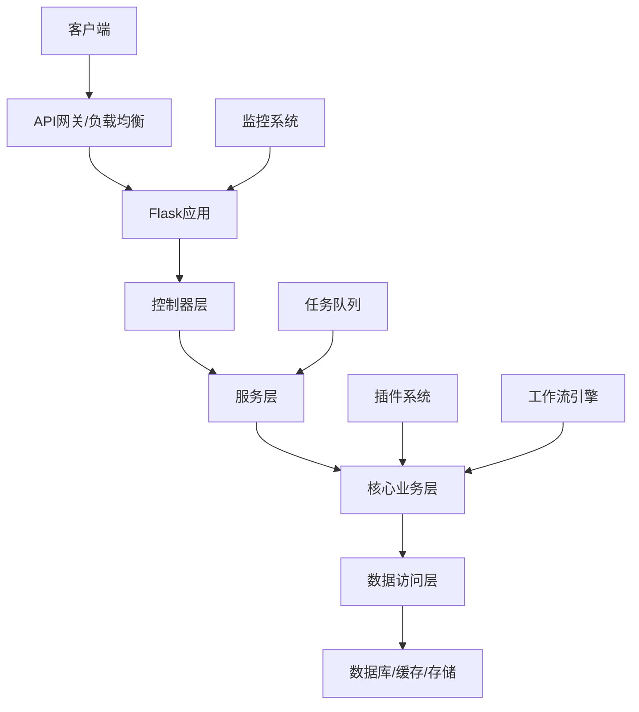
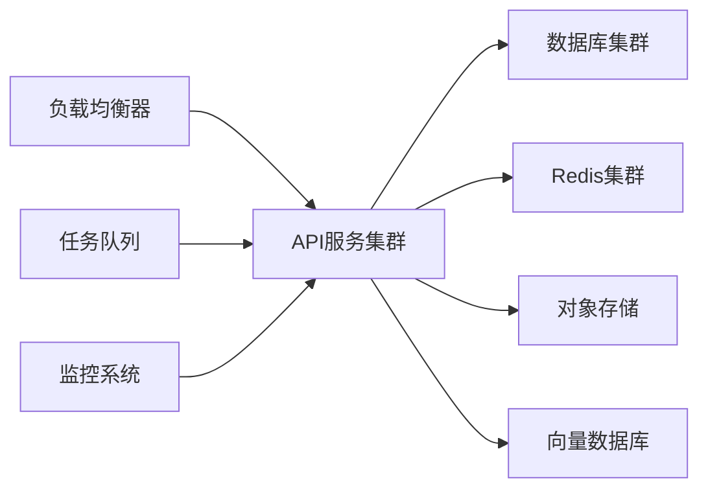

# Dify API 项目结构文档

## 项目简介

Dify API 是一个基于 Flask 的 AI 应用开发平台后端服务，提供完整的 AI 应用构建、部署和管理功能。项目采用分层架构设计，支持多租户、插件扩展、工作流引擎等企业级特性。

## 技术栈

- **Web框架**: Flask
- **ORM**: SQLAlchemy
- **数据库**: PostgreSQL/MySQL
- **缓存**: Redis
- **任务队列**: Celery
- **AI模型**: LLM、RAG、AI Agent
- **向量数据库**: Weaviate、Pinecone、Qdrant、Milvus
- **存储**: 本地、S3兼容、Azure Blob、Google Cloud Storage

## 核心架构



## 目录结构概览

```
api/
├── app.py                 # 应用入口
├── app_factory.py         # 应用工厂
├── commands.py            # CLI命令
├── configs/               # 配置管理
├── controllers/           # 控制器层
├── core/                  # 核心业务层
├── services/              # 服务层
├── models/                # 数据模型
├── migrations/            # 数据库迁移
├── tasks/                 # 异步任务
├── extensions/            # 扩展功能
├── libs/                  # 工具库
└── tests/                 # 测试代码
```

## 主要功能模块

### 1. 应用管理
- 应用创建、配置、部署
- 多模态支持（文本、图像、音频）
- 应用模板和DSL

### 2. AI能力
- 大语言模型集成
- RAG检索增强生成
- AI Agent工作流
- 多模型提供商支持

### 3. 数据管理
- 数据集管理
- 文档处理和索引
- 向量数据库集成
- 文件存储管理

### 4. 工作流引擎
- 可视化工作流设计
- 节点执行和状态管理
- 条件分支和循环
- 错误处理和重试

### 5. 插件系统
- 插件开发框架
- 动态加载和热更新
- API集成和工具扩展
- 插件市场管理

### 6. 多租户支持
- 租户隔离
- 工作空间管理
- 资源配额控制
- 权限管理

## 部署架构



## 开发指南

### 环境搭建
1. 安装Python 3.8+
2. 安装依赖: `pip install -r requirements.txt`
3. 配置环境变量
4. 初始化数据库: `flask db upgrade`
5. 启动服务: `python app.py`

### 代码规范
- 遵循PEP 8编码规范
- 使用类型注解
- 编写单元测试
- 添加文档字符串

### 贡献流程
1. Fork项目
2. 创建功能分支
3. 提交代码
4. 创建Pull Request

## 相关文档

### 原始文档
- [API结构文档](doc/结构文档.md) - 详细的API接口文档
- [数据库设计](doc/数据库设计.md) - 数据库表结构设计
- [登录鉴权流程](doc/登录跟鉴权流程.md) - 认证授权机制说明

### 模块详细文档
- [01-应用入口层](modules/01-应用入口层.md) - 应用启动、配置、CLI命令
- [02-配置管理层](modules/02-配置管理层.md) - 配置系统、环境管理、远程配置
- [03-控制器层](modules/03-控制器层.md) - API接口、请求处理、响应格式化
- [04-核心业务层-概述](modules/04-核心业务层-概述.md) - AI核心功能、工作流、插件系统
- [05-服务层](modules/05-服务层.md) - 业务逻辑、服务编排、事务管理
- [06-数据模型层](modules/06-数据模型层.md) - 数据实体、数据库设计、ORM映射

### 待完善模块文档
- [07-常量定义层](modules/07-常量定义层.md) - 系统常量、枚举定义、国际化
- [08-上下文管理层](modules/08-上下文管理层.md) - 请求上下文、会话管理、状态保持
- [09-事件系统](modules/09-事件系统.md) - 事件驱动、消息队列、异步处理
- [10-扩展系统](modules/10-扩展系统.md) - 扩展机制、中间件、自定义功能
- [11-工厂模式层](modules/11-工厂模式层.md) - 对象创建、依赖注入、实例管理
- [12-字段定义层](modules/12-字段定义层.md) - 数据验证、序列化、类型转换
- [13-工具库层](modules/13-工具库层.md) - 通用工具、辅助函数、第三方集成
- [14-仓储层](modules/14-仓储层.md) - 数据访问、查询优化、缓存策略
- [15-定时任务层](modules/15-定时任务层.md) - 定时任务、后台作业、系统维护
- [16-异步任务层](modules/16-异步任务层.md) - 任务队列、并发处理、状态跟踪
- [17-测试框架](modules/17-测试框架.md) - 单元测试、集成测试、测试工具

---

*本文档提供了Dify API项目的整体架构和模块说明，详细的技术实现请参考各模块的具体文档。* 